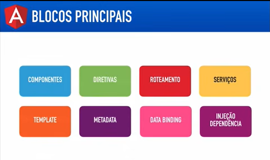

# Angular V2

## Aula 01 - Introdução e Arquitetura

### Overview - O que será aprendido

1. Introdução
2. Componentes e Templates
3. Data binding
4. Diretivas
5. Serviços
6. Formulários
7. Roteamento
8. Integração com servidor
9. CRUD Metre-Detalhe

### Pré-requisitos

- HTML
- CSS
- JavaScript

### Site Principal

https://angular.io

O Angular 2 é uma parceria Google + Microsoft
É Open Source (Código Fonte no GitHub)

## Blocos Principais

- Componentes
- Diretivas
- Roteamento
- Serviços
- Templates
- Metadata
- Data Binding
- Injeção Dependências

### Componentes

Encapsula:

- Template
- Metadata: processamento das classes
- Dado a ser mostrado na tela (Data Binding)
- Comportamento da VIEW

