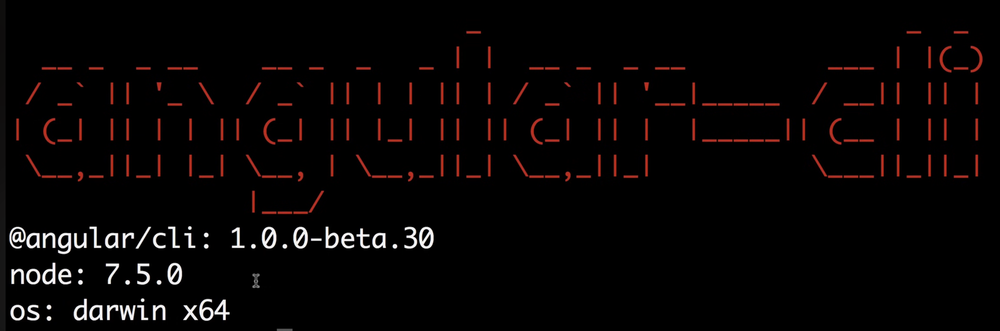
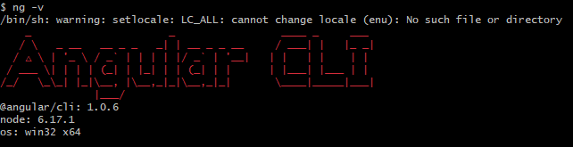

# Angular V2

## Aula 02 - Ambiente de desenvolvimento (Node.Js, TypeScript, Angular CLI)

### Pré-requisitos

Para realização do curso será utilizado as versões:

- **Node**: v7.5.0 (Donwgrade para a versão v6.17.1)
- TypeScript: 2.0.10
- Angular CLI: 1.0.0 (Devido a erros, atualizado para versão 1.0.6)
- VS Code: Versão Atual

## Node.Js

Node.js (O Motores e Gerenciador do Ambiente)

- **O que é**: O *Node.js* é um ambiente de execução que permite rodar código JavaScript diretamente no seu sistema operacional, fora do navegador web.

- **Para que serve no Angular**: Ele não roda a sua aplicação final no navegador do usuário, mas sustenta todas as ferramentas de desenvolvimento na sua máquina. O Node inclui o NPM (*Node Package Manager*), que instala as bibliotecas do Angular, gerencia dependências e roda o servidor local de testes enquanto você programa.

#### Node - Download e Instalação

Link para download da versão oficial

https://nodejs.org/pt-br/download

**Nota**: Dependendo de quando for realizar este curso, a versão corrente poderá ser superior a versão utilizada durante as aulas, exigindo adaptação ou conhecimento para acompanhar e aplicar o código desenvolvido.

Como solução palitiva foi necessário recorrer ao download através do histórico do **Node.Js**, através do link abaixo:

https://nodejs.org/download/release/

https://nodejs.org/pt-br/download/archive/v6.17.1

## TypeScript

- **O que é**: É um "superconjunto" (superset) do JavaScript criado pela Microsoft. Ele adiciona tipagem estática e recursos avançados de Programação Orientada a Objetos ao JavaScript padrão.

- **Para que serve no Angular**: O Angular 2 foi totalmente construído em TypeScript. A tipagem ajuda a capturar erros de código enquanto você digita (em vez de descobrir o erro só ao testar no navegador) e melhora o autocompletar na IDE. Como os navegadores só entendem JavaScript puro, o TypeScript é "transpilado" (convertido) em JavaScript comum durante o processo de compilação.

#### TypeScript - Instalação

```bash
# Instalar a Versão Current (Versão Atual)
npm install -g typescript

# Instalar o TypeScript Versões Anteriores
npm install -g typescript@2.0.10
```

**Nota Versão Anteriores**: Necessário informar a versão `@` + `Versão Desejada`.

## Angular CLI (O Assistente de Linha de Comando)

- **O que é**: CLI significa Command Line Interface (Interface de Linha de Comando). É uma ferramenta executada pelo terminal criada pela equipe do Angular.

- **Para que serve no Angular**: Automatiza tarefas complexas de configuração e estrutura. Em vez de criar arquivos, pastas e rotinas de compilação manualmente, você usa comandos simples do CLI para:

    - Criar um novo projeto (`ng new`)
    - Gerar componentes, serviços e módulos (`ng generate`)
    - Subir um servidor local com atualização em tempo real (`ng serve`)
    - Compilar o projeto final para produção (`ng build`)

#### Angular CLI - Instalação

```bash
# Instalar a Versão Current (Versão Atual)
npm install -g @angular/cli

# Instalar a versão compatível do Angular CLI
npm install -g @angular/cli@1.0.0
# Devido a alguns erros apresentados tive que realizar a instação da versão 1.0.6
npm install -g @angular/cli@1.0.6
```

**Nota Versão Anteriores**: Necessário informar a versão `@` + `Versão Desejada`.

### Conferirndo as Versões Instaladas

Abre o terminal e digite:

```bash
ng -v
```

Saída Esperada:



Versões instaladas na máquina local



#### Desinstalando Angular

```bash
# Limpar caches de versões antigas do CLI, se houver
npm uninstall -g @angular/cli angular-cli
npm cache clean --force
```

### Dica importante para o arquivo `package.json`

Ao criar um novo projeto ou rodar um curso antigo, garanta que o arquivo `package.json` dentro da pasta do projeto mantenha as dependências alinhadas nesta faixa:

```JSON
"dependencies": {
  "@angular/common": "^2.4.0",
  "@angular/compiler": "^2.4.0",
  "@angular/core": "^2.4.0",
  "@angular/forms": "^2.4.0",
  "@angular/http": "^2.4.0",
  "@angular/platform-browser": "^2.4.0",
  "@angular/platform-browser-dynamic": "^2.4.0",
  "@angular/router": "^3.4.0",
  "rxjs": "^5.0.1",
  "zone.js": "^0.7.2"
},
"devDependencies": {
  "@angular/cli": "1.0.0",
  "@angular/compiler-cli": "^2.4.0",
  "typescript": "~2.0.10"
}
```

Após compatibilizar todas as versões e dependências para o Bootstrap, as versões declaradas no `package.json`, tiveram estas declarações.

```JSON
  "dependencies": {
    "@angular/common": "2.4.10",
    "@angular/compiler": "2.4.10",
    "@angular/core": "2.4.10",
    "@angular/forms": "2.4.10",
    "@angular/http": "2.4.10",
    "@angular/platform-browser": "2.4.10",
    "@angular/platform-browser-dynamic": "2.4.10",
    "@angular/router": "3.4.10",
    "bootstrap": "4.0.0-alpha.4",
    "core-js": "^2.4.1",
    "jquery": "^2.2.4",
    "rxjs": "5.0.1",
    "ts-helpers": "^1.1.2",
    "zone.js": "^0.7.2"
  },
  "devDependencies": {
    "@angular/cli": "1.0.0",
    "@types/jasmine": "^2.5.38",
    "@types/node": "~6.0.60",
    "codelyzer": "~2.0.0",
    "jasmine-core": "~2.5.2",
    "jasmine-spec-reporter": "~3.2.0",
    "karma": "~1.4.1",
    "karma-chrome-launcher": "^2.0.0",
    "karma-cli": "~1.0.1",
    "karma-jasmine": "^1.1.0",
    "karma-remap-istanbul": "^0.6.0",
    "protractor": "~4.0.14",
    "ts-node": "~2.0.0",
    "tslint": "~4.5.0",
    "typescript": "2.0.10"
  }
```

## Editor de Texto

Pode ser utilizado o editor de texto da sua preferência, 
Visual Studio Code (VS Code), WebStorm, Atom, Sublime Text.

Para este curso utilizarei o VS Code.

### Visual Studio Code (VS Code)

O VS Code é a escolha mais popular da comunidade por ser rápido e altamente extensível.

- **Leve e Rápido**: Abre em segundos e consome poucos recursos do computador.
- **Extensões Poderosas**: Possui add-ons como React Native Tools para criar pontos de parada (breakpoints) e inspecionar estados.
- **Gratuito e Aberto**: Totalmente livre para uso pessoal e comercial.
- **Personalizável**: Você monta seu ambiente instalando pacotes de formatação, temas e atalhos.

### Link para Download

https://code.visualstudio.com/

### Variaveis de Ambiente Windows

- Path

```text
C:\Program Files\nodejs\
```