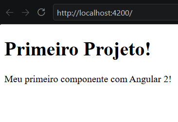
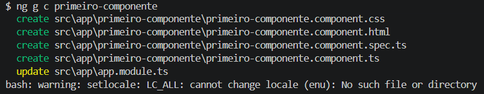

# Angular V2

## Aula 03 - Criando Nosso Primeiro Projeto e Primeiro Componente

### Criando e Rodando o Projeto

1. Navegue pelo terminal até a pasta onde deseja salvar o seu sistema.

2. Digite o comando de criação trocando o nome pelo que preferir: `ng new meu-projeto`.

    ```bash
    # Criando o projeto 'projeto-inicial'
    ng new projeto-inicial

    # Apenas Criando o Projeto (Sem baixar as dependências)
    ng new projeto-inicial --skip-install
    ```

3. **OBS**: Nas versões atuais, responda às perguntas interativas no terminal sobre qual estilo de folha de rosto deseja usar (como CSS padrão).

4. Entre na pasta criada digitando cd meu-projeto.

5. Inicie o servidor local com o comando `ng s` (ou `ng serve`).

    ```bash
    ng serve
    ```

6. Abra o navegador e acesse o endereço http://localhost:4200 para ver sua página inicial rodando.

### Analisando o Projeto

Analisando estrutura do projeto, identitificamos o arquivo `app.componente.html`, e constatamos que o conteúdo apresentado na página inicial do projeto esta exibindo o conteudo do `app.componente.ts`, por **interpolação**.

```html
<h1>
  {{title}}
</h1>
```

## Live Reload

O Live Reload (ou atualização em tempo real) é um recurso do Angular que atualiza a sua página no navegador de forma automática toda vez que você altera e salva um arquivo do código. Você não precisa atualizar a aba do navegador manualmente para ver o resultado.

### Como ele funciona por trás dos panos

- O comando `ng serve` inicia um servidor de desenvolvimento local.
- Esse servidor cria um canal de comunicação direta com o seu navegador.
- Quando você salva uma alteração, o Angular recompila apenas o arquivo modificado.
- O servidor avisa o navegador que o código mudou e a página atualiza instantaneamente.

### Principais vantagens no dia a dia

- **Aumenta a produtividade**: Remove a necessidade de clicar no botão "Recarregar" (F5).
- **Feedback instantâneo**: Você vê erros ou acertos de design e lógica no mesmo segundo.
- **Foco contínuo**: Você mantém a atenção dividida apenas entre o editor de código e o resultado visual.

### Dica (Desativar o Live Reload)

Se por algum motivo você quiser rodar o projeto Angular sem essa atualização automática, você pode desativar o recurso rodando o servidor com o comando `ng serve --live-reload=false`.

## Criando um Component Manualmente

Para criar um componente manualmente no Angular, você precisa criar os arquivos na pasta correta e depois registrar a classe no sistema. Embora a ferramenta automática `ng generate component` seja o padrão, o processo manual ajuda a entender a arquitetura do framework.

### 1. Estrutura Básica de Arquivos

Navegue até a pasta `src/app/` do seu projeto e crie uma nova pasta com o nome do seu componente (por exemplo, meu-botao). Dentro dela, crie três arquivos essenciais:

- `meu-botao.component.ts` (Lógica do componente)
- `meu-botao.component.html` (Interface visual)
- `meu-botao.component.css` (Estilo visual)

### 2. Escrevendo o Código do Arquivo TypeScript (.ts)

Abra o arquivo `meu-botao.component.ts` e adicione a estrutura abaixo. O Angular moderno usa Standalone Components por padrão, o que significa que o componente gerencia suas próprias importações:


```typescript
import { Component } from '@angular/core';

@Component({
  selector: 'app-meu-botao',
  standalone: true,
  imports: [],
  templateUrl: './meu-botao.component.html',
  styleUrls: ['./meu-botao.component.css']
})
export class MeuBotaoComponent {
  // Sua lógica e variáveis entram aqui
}
```

### 3. Criando o Conteúdo Visual e Estilo

No arquivo `meu-botao.component.html`, adicione a marcação:

```html
<button class="btn-custom">Clique aqui!</button>
```

No arquivo `meu-botao.component.css`, adicione a estilização:

```css
.btn-custom { background-color: blue; color: white; padding: 10px; }
```

### 4. Utilizando o Componente Criado

Para exibir o novo componente na tela principal, você deve declará-lo no arquivo onde deseja usá-lo (geralmente o app.component.ts):

1. Abra o arquivo `src/app/app.component.ts`.
2. Adicione a importação no topo: `import { MeuBotaoComponent } from './meu-botao/meu-botao.component'`;.
3. Adicione a classe dentro da lista de `imports` do `@Component: imports: [MeuBotaoComponent, ...]`.
4. Abra o arquivo `src/app/app.component.html` e insira a tag do seletor que você definiu:

```html
<app-meu-botao></app-meu-botao>
```

Imagem da funcionadade do App com o primeiro-componente criado manualmente.



## Crinado Component com CLI

Para criar o mesmo componente usando o Angular CLI, basta executar uma única linha de comando no seu terminal. A ferramenta cria todos os arquivos de forma automática, gera o código base estruturado e configura os seletores sem risco de erros de digitação.

### Comando Básico

Abra o terminal na pasta raiz do seu projeto e digite:

```bash
# Comando Completo
ng generate component primeiro-componente

# Comando Abreviado
ng g c primeiro-componente
```

### O que o comando faz

Assim que você aperta Enter, o Angular CLI realiza as seguintes ações automaticamente:

- Cria uma pasta chamada `primeiro-componente` dentro do diretório src/app/.
- Cria o arquivo de lógica `primeiro-componente.component.ts` com o código estruturado.
- Cria o arquivo de visualização `primeiro-componente.component.html`.
- Cria o arquivo de estilo `primeiro-componente.component.css`.
- Cria um arquivo de testes `primeiro-componente.component.spec.ts`.



### Como usar após a criação

O processo para exibir o componente na tela é idêntico ao manual, pois o Angular CLI cria componentes independentes (standalone) por padrão:

- Abra o arquivo `src/app/app.component.ts`.
- Importe o componente na lista de imports:

```typescript
imports: [ PrimeiroComponenteComponent ]
```

- Insira a tag do componente no arquivo `src/app/app.component.html`:

```html
<app-primeiro-componente></app-primeiro-componente>
```

#### Variações úteis do comando

Você pode customizar a criação adicionando parâmetros ao final do comando:

- Criar em uma pasta específica: `ng g c componentes/meu-botao` (cria dentro de uma pasta chamada `'componentes'`).
- Sem arquivo de testes: `ng g c meu-botao --skip-tests` (evita a criação do arquivo **.spec.ts**).
- Estilo em linha: `ng g c meu-botao -i` (não cria o arquivo **.css**, coloca o estilo direto no **.ts**).
- HTML em linha: `ng g c meu-botao -t` (não cria o arquivo **.html**, coloca a estrutura direto no **.ts**).


Depois de rodar o comando, o processo para exibir o componente na tela é o mesmo: basta importar a classe MeuBotaoComponent na lista de imports do seu app.component.ts e usar a tag <app-meu-botao></app-meu-botao> no HTML principal.