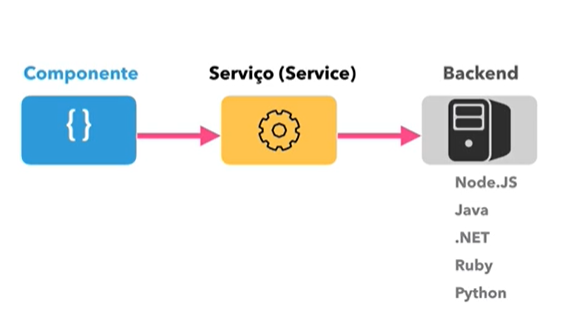

# Angular V2

## Aula 07 - Serviços (Services) e Injeção de dependência (DI)

### Diagrama Comunicação Componente Serviço



Comando para criação de serviço:

```bash
ng g s cursos/cursos

# Ou o Comando Completo
ng g service cursos/cursos
```

**Nota**: Na versão v2, sem o standalone, para viabilizar a injeção de dependência da classe de serviço CursosServices, via construtor, é necessário declarar nos providers:

```text
providers: [ CursosService ]
```

### Serviços e Injeção de Dependência (DI)

No Angular, Serviços e Injeção de Dependência (DI) são o coração da arquitetura da aplicação. Eles seguem o princípio de responsabilidade única (SRP), separando a lógica de negócios e dados da camada de apresentação (componentes).

### 1. O que é um Serviço (Service)?

Um Serviço é uma classe TypeScript projetada para executar tarefas específicas que não estão ligadas diretamente à interface do usuário.

#### Para que servem os serviços?

- Compartilhar dados/estado entre componentes que não possuem relação direta (pai/filho).
- Consumir APIs HTTP (fazer requisições para o backend).
- Isolar lógica de negócios complexa (ex: validações, cálculos, formatações).
- Encapsular acesso a recursos externos (ex: LocalStorage, WebSockets).

### 2. O que é Injeção de Dependência (Dependency Injection - DI)?

Injeção de Dependência é um padrão de projeto em que uma classe não cria as instâncias das coisas de que precisa para funcionar; em vez disso, ela recebe (recebe "injetado") essas instâncias de uma fonte externa (o injetor do Angular).

Em vez de fazer isso:

```TypeScript
// MÁ PRÁTICA: O componente gerencia a própria instância
export class UserProfileComponent {
  private userService = new UserService(); // Acoplamento forte!
}
```

O Angular gerencia a criação, o ciclo de vida e a entrega da instância para o componente:

```TypeScript
// BOA PRÁTICA: O Angular injeta a instância existente

export class UserProfileComponent {
  private userService = inject(UserService); // O Angular fornece a dependência!
}
```

### 3. Como Criar e Usar um Serviço

#### Criando um Serviço

Você pode criar um serviço usando o Angular CLI:

```Bash
ng generate service services/user
# ou simplesmente: ng g s services/user
```

O arquivo gerado (user.service.ts) terá esta estrutura básica:

```TypeScript
import { Injectable, inject } from '@angular/core';
import { HttpClient } from '@angular/common/http';
import { Observable } from 'rxjs';

export interface User {
  id: number;
  name: string;
  email: string;
}

@Injectable({
  providedIn: 'root' // Define onde o serviço estará disponível
})
export class UserService {
  private http = inject(HttpClient);
  private apiUrl = 'https://api.exemplo.com/users';

  getUsers(): Observable<User[]> {
    return this.http.get<User[]>(this.apiUrl);
  }
}
```

### 4. Como Injetar o Serviço no Componente

Existem duas formas de injetar um serviço em um componente:

#### Forma Moderna (Recomendada - Angular 14+)

Utiliza a função `inject()`. Deixa o código mais limpo e facilita o reuso/herança de classes.

```TypeScript
import { Component, inject, OnInit, signal } from '@angular/core';
import { UserService, User } from './services/user.service';

@Component({
  selector: 'app-user-list',
  standalone: true,
  template: `
    <h2>Lista de Usuários</h2>
    <ul>
      @for (user of users(); track user.id) {
        <li>{{ user.name }} ({{ user.email }})</li>
      }
    </ul>
  `
})
export class UserListComponent implements OnInit {
  // Injeção usando inject()
  private userService = inject(UserService);
  
  users = signal<User[]>([]);

  ngOnInit() {
    this.userService.getUsers().subscribe(data => {
      this.users.set(data);
    });
  }
}
```

Forma Tradicional (Via Construtor)

Injeta o serviço diretamente nos parâmetros do construtor.

```TypeScript
export class UserListComponent implements OnInit {
  users = signal<User[]>([]);

  // Injeção via construtor
  constructor(private userService: UserService) {}

  ngOnInit() {
    this.userService.getUsers().subscribe(data => this.users.set(data));
  }
}
```

### 5. Escopo e Hierarquia dos Provedores (providedIn)

A propriedade `providedIn` no decorator `@Injectable()` define a visibilidade e o tempo de vida (singleton) da instância do serviço.

| Configuração | Escopo | Descrição | 
| :--- | :--- | :--- | 
| `providedIn: 'root'` | **Aplicação inteira (Singleton)** | É o padrão. O Angular cria uma única instância para a aplicação toda. Permite tree-shaking (se não for usado, não entra no build final). | 
| `providers: [MeuServico]` (no Componente) | **Nível do Componente** | O Angular cria uma nova instância do serviço sempre que esse componente for instanciado. O serviço é destruído junto com o componente. | 
| `providers: [MeuServico]` (na Rota) | **Nível da Rota** | A instância vive enquanto o usuário estiver navegando naquela rota/fluxo específico. |

#### Exemplo de Serviço com escopo por Componente:

```TypeScript
@Component({
  selector: 'app-carrinho',
  standalone: true,
  providers: [CarrinhoService] // Uma nova instância é criada a cada <app-carrinho>
})
export class CarrinhoComponent {
  private carrinhoService = inject(CarrinhoService);
}
```

### 6. Vantagens do Uso de DI e Serviços

1. **Reutilização de Código**: Múltiplos componentes utilizam o mesmo serviço de busca de dados ou autenticação sem duplicar código.
2. **Testabilidade (Unit Tests)**: Como as dependências são injetadas, fica fácil substituir um serviço real por um serviço de testes (*Mock Service*) durante testes unitários.
3. **Manutenibilidade**: Se a API REST mudar, você altera o código apenas no `Service`, e não em 20 componentes diferentes.
4. **Acoplamento Fraco**: O componente não precisa saber como o serviço obtém os dados (se vem do LocalStorage, HTTP ou IndexedDB), apenas consome o método.