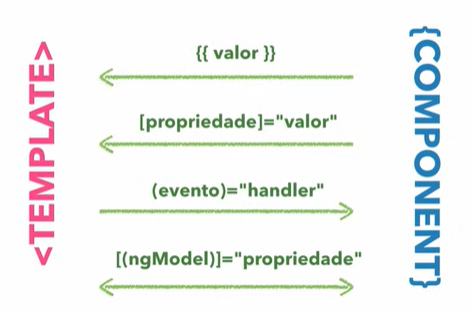
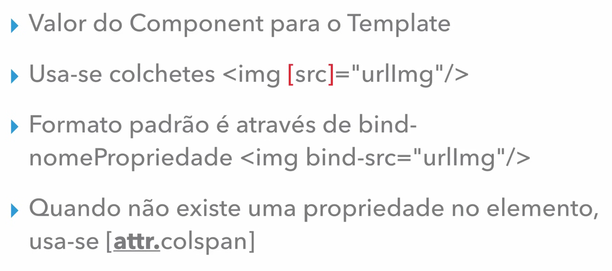

# Angular V2

## Aula 09 - Property binding + Interpolation

## As 4 Sintaxes Principais

A magia do template acontece na forma como ele se comunica com a classe TypeScript do componente. Existem 4 formas principais de fazer essa integração:



### 1. Interpolação {{ valor }}

Exibe dados da classe TypeScript diretamente no HTML.

- TypeScript:

```TypeScript
export class PerfilComponent {
  usuario = 'Carlos';
  idade = 28;
}
```

- Template (HTML):

```HTML
<h2>Usuário: {{ usuario }}</h2>
<p>Idade: {{ idade }} anos</p>
<p>Ano de nascimento: {{ 2026 - idade }}</p> <!-- Aceita expressões simples -->
```

### 2. Property Binding [propriedade]="valor"

Associa uma propriedade de um elemento HTML (como `src`, `disabled`, `href`, `value`) a uma variável do TypeScript.

- TypeScript:

```TypeScript
export class BotaoComponent {
  urlImagem = 'assets/avatar.png';
  isDesabilitado = true;
}
```

- Template (HTML):

```HTML

<button [disabled]="isDesabilitado">Enviar</button>
```

## Comandos Executados Para Criação de Projeto de Exemplo

```bash
# Criação Novo Projeto
ng new data-binding

# Criação Novo Componente
ng g c data-binding

#Saída
#  create src\app\data-binding\data-binding.component.css
#  create src\app\data-binding\data-binding.component.html
#  create src\app\data-binding\data-binding.component.spec.ts
#  create src\app\data-binding\data-binding.component.ts
#  update src\app\app.module.ts
```

