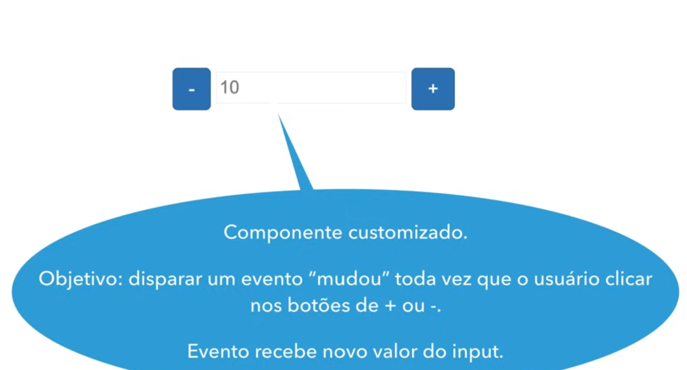

# Angular V2

## Aula 14 - Emitindo Eventos com Output Properties

Projeto desenvolvido em aula, para exemplificar a emissão de evento e uso do `@Output`.



No Angular, Input e Output são os mecanismos fundamentais para a comunicação entre componentes em uma relação de Pai para Filho (Parent to Child) e Filho para Pai (Child to Parent).

- `Input`: O componente pai envia dados para o componente filho.

- `Output`: O componente filho dispara eventos para notificar o componente pai sobre alguma ação.

Angular v2 (quando a versão baseada em TypeScript foi lançada após o AngularJS), a comunicação entre componentes dependia exclusivamente dos Decorators @Input() e @Output() em conjunto com a classe EventEmitter.

    Nota: O Input Properties possui um objetivo diferente das diretivas.

### 2. `@Output()` e `EventEmitter` (Filho envia eventos para o Pai)

Para emitir um evento do filho em direção ao pai, utiliza-se a combinação de `@Output()` com uma instância de `EventEmitter`.

**Componente Filho** (button-counter.component.ts)

```TypeScript
import { Component, Output, EventEmitter } from '@angular/core';

@Component({
  selector: 'app-button-counter',
  template: `
    <button (click)="incrementar()">Clique aqui para contar</button>
  `
})
export class ButtonCounterComponent {
  // Instancia o EventEmitter responsável por disparar o evento
  @Output() onIncrement = new EventEmitter<number>();

  private totalClicks: number = 0;

  incrementar() {
    this.totalClicks++;
    // Dispara o evento passando o dado (payload) como argumento
    this.onIncrement.emit(this.totalClicks);
  }
}
```

**Componente Pai** (app.component.ts)

No HTML do pai, escuta-se o evento usando **Event Binding** com parênteses `(evento)` e acessa-se o dado emitido através da variável reservada `$event`:

```TypeScript
import { Component } from '@angular/core';

@Component({
  selector: 'app-root',
  template: `
    <h1>Contador do Pai</h1>
    <p>Total de cliques recebidos: {{ contagem }}</p>

    <!-- Captura o evento (onIncrement) e passa a variável $event -->
    <app-button-counter (onIncrement)="atualizarContador($event)"></app-button-counter>
  `
})
export class AppComponent {
  contagem: number = 0;

  atualizarContador(novoValor: number) {
    this.contagem = novoValor;
  }
}
```

### 3. Alias em @Input() e @Output() (Sintaxe de Renomeação)

No Angular v2, era possível definir um nome público para a propriedade no template do pai diferente do nome interno da variável na classe do filho.

```TypeScript
export class UserCardComponent {
  // No HTML do pai usará (userSelected), mas internamente é 'onSelect'
  @Output('userSelected') onSelect = new EventEmitter<void>();
}
```

### 4. Forma alternativa via Metadata do `@Component`

Além dos decorators, o Angular v2 permitia declarar os inputs e outputs diretamente dentro do objeto de metadados do `@Component` (embora usar decorators fosse a boa prática recomendada):

```TypeScript
@Component({
  selector: 'app-exemplo',
  template: `<p>{{ titulo }}</p>`,
  outputs: ['aoSalvar'] // Equivalente a @Output() aoSalvar = new EventEmitter();
})
export class ExemploComponent {
  titulo: string;
  aoSalvar = new EventEmitter<boolean>();
}
```

### Principais diferenças a ter em mente em projetos legados v2:

1. `NgModules` **OBRIGATÓRIOS**: No Angular v2, componentes não eram standalone. Todos os componentes que usavam `@Input` ou `@Output` precisavam estar obrigatoriamente declarados no array `declarations` de um `@NgModule` (geralmente o `AppModule`).

2. *Sem Signals ou APIs Funcionais*: Não existiam funções como `input()`, `output()` ou `model()`.

3. Uso de `EventEmitter` obrigatório: Diferente dos `output()` modernos que são emissores leves nativos, no legado a importação do `EventEmitter` do `@angular/core` era indispensável para enviar eventos.

## Angular 17+

### 2. Output Properties (Enviando eventos para o Pai)

A propriedade Output permite que o componente filho emita um evento contendo informações (payload) para o componente pai reagir.

#### A) Sintaxe Moderna (`output()`) — Angular 17.3+ (Recomendado)

A nova função `output()` substitui o uso do `EventEmitter` de forma mais leve e tipada.

**Componente Filho** (alert-button.component.ts):

```TypeScript
import { Component, output } from '@angular/core';

@Component({
  selector: 'app-alert-button',
  standalone: true,
  template: `
    <button (click)="notificarPai()">Confirmar Ação</button>
  `
})
export class AlertButtonComponent {
  // Cria o emissor de evento informando o tipo do payload
  actionConfirmed = output<string>();

  notificarPai() {
    // Emite o evento com o dado
    this.actionConfirmed.emit('O usuário confirmou a operação!');
  }
}
```

**Componente Pai** (app.component.ts e HTML):

```TypeScript
@Component({
  selector: 'app-root',
  standalone: true,
  imports: [AlertButtonComponent],
  template: `
    <!-- Escuta o evento usando Event Binding (nomeDoOutput)="metodo($event)" -->
    <app-alert-button (actionConfirmed)="receberNotificacao($event)" />
  `
})
export class AppComponent {
  receberNotificacao(mensagem: string) {
    console.log('Mensagem recebida do filho:', mensagem);
  }
}
```

#### B) Sintaxe Tradicional (@Output() com EventEmitter)

```TypeScript
import { Component, Output, EventEmitter } from '@angular/core';

@Component({
  selector: 'app-alert-button',
  standalone: true,
  template: `<button (click)="notificarPai()">Confirmar</button>`
})
export class AlertButtonComponent {
  @Output() actionConfirmed = new EventEmitter<string>();

  notificarPai() {
    this.actionConfirmed.emit('O usuário confirmou a operação!');
  }
}
```

### 3. Two-Way Data Binding com model() (Angular 17.2+)

Quando você precisa que um valor flua nas duas direções entre Pai e Filho (como um Input e Output combinados), o Angular introduziu os Model Signals.

**Componente Filho** (counter.component.ts):

```TypeScript
import { Component, model } from '@angular/core';

@Component({
  selector: 'app-counter',
  standalone: true,
  template: `
    <button (click)="decrementar()">-</button>
    <span>{{ value() }}</span>
    <button (click)="incrementar()">+</button>
  `
})
export class CounterComponent {
  // Define que a propriedade permite Two-Way Binding
  value = model<number>(0);

  incrementar() {
    this.value.update(v => v + 1); // Atualiza no filho E no pai simultaneamente
  }

  decrementar() {
    this.value.update(v => v - 1);
  }
}
```

**Componente Pai** (app.component.html):

```HTML
<!-- Dupla sintaxe [(propriedade)] (Banana in a Box) -->
<app-counter [(value)]="totalContador" />
<p>Valor atual no pai: {{ totalContador() }}</p>
```

### Resumo Comparativo

| Funcionalidade | Sintaxe Tradicional | Sintaxe Moderna (Angular 17+) | Fluxo dos Dados |
| :--- | :--- | :--- | :--- |
| **Entrada de Dados** | `@Input()` | `input()` / `input.required()` | Pai → Filho |
| **Saída de Eventos** | `@Output()` + `EventEmitter` | `output()` | Filho → Pai |
| **Sincronização Dupla** | Custom `@Input` + `@Output` (`Change`) | model() | Pai ↔ Filho |