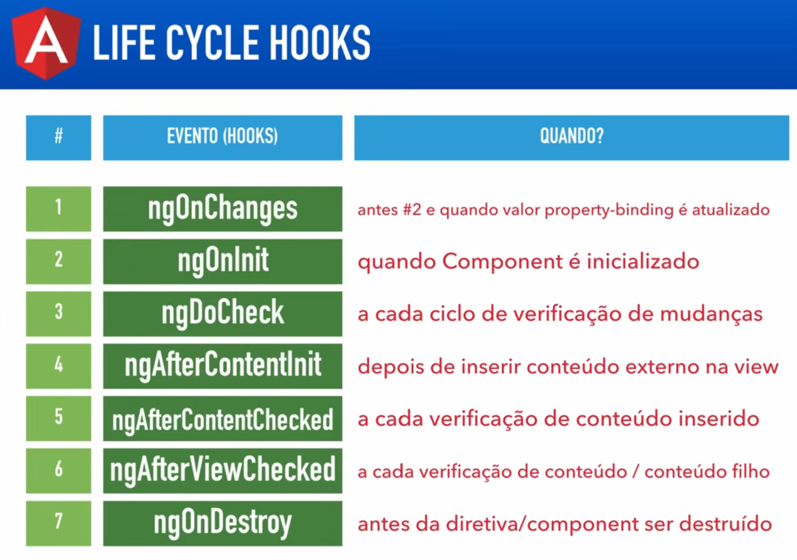
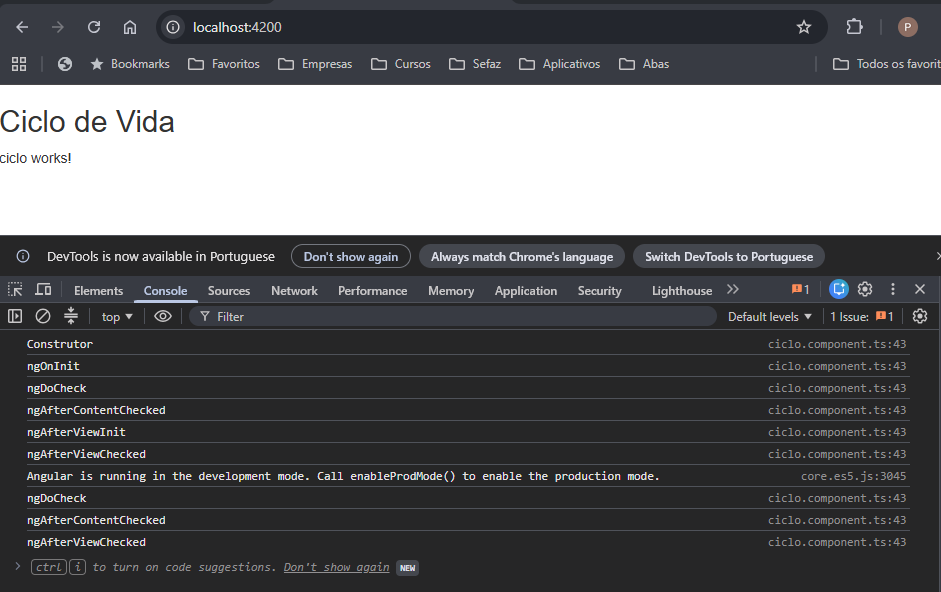

# Angular V2

## Aula 15 - Ciclo de vida (life-cycle) do Componente

### Ciclo de Vida

O Ciclo de Vida do Componente (Component Lifecycle) descreve a sequência de etapas que um componente percorre desde a sua criação até a sua destruição no Angular.

O Angular gerencia essa sequência e expõe hooks (métodos de ciclo de vida) que permitem executar códigos em momentos específicos desse processo.

### 1. Fluxo Sequencial dos Hooks (Visão Geral)

Quando o Angular instancia e renderiza um componente, os métodos são executados na seguinte ordem cronológica:



```Plaintext
[ Construtor da Classe ]
       │
       ▼
[ 1. ngOnChanges ]      ──► (Roda quando um @Input / input() muda)
       │
       ▼
[ 2. ngOnInit ]         ──► (Roda uma única vez após a inicialização)
       │
       ▼
[ 3. ngDoCheck ]        ──► (Detecção de mudanças customizada)
       │
       ├──► [ 4. ngAfterContentInit ]   ──► (Após projetar conteúdo / <ng-content>)
       ├──► [ 5. ngAfterContentChecked ] ──► (Após checar o conteúdo projetado)
       ├──► [ 6. ngAfterViewInit ]      ──► (Após inicializar a view do componente e filhos)
       └──► [ 7. ngAfterViewChecked ]   ──► (Após checar a view do componente)
       │
       ▼
[ 8. ngOnDestroy ]      ──► (Roda imediatamente antes da destruição do componente)
```

### 2. Detalhamento de Cada Hook

Para utilizar um hook, implementa-se a interface correspondente importada de `@angular/core`:

#### 1. `ngOnChanges(changes: SimpleChanges)`

- **Quando roda**: Sempre que o valor de uma propriedade de entrada (`@Input()`) é atribuído ou modificado. Roda antes do ngOnInit na primeira vez.
- **Para que serve**: Responder a alterações nos dados enviados pelo componente pai.
- **Exemplo**:

```TypeScript
export class UserCardComponent implements OnChanges {
  @Input() userId!: string;

  ngOnChanges(changes: SimpleChanges) {
    if (changes['userId']) {
      console.log('ID anterior:', changes['userId'].previousValue);
      console.log('Novo ID:', changes['userId'].currentValue);
    }
  }
}
```

#### 2. `ngOnInit()`

- **Quando roda**: Uma única vez, logo após o primeiro ngOnChanges.
- **Para que serve**: Inicialização de dados, chamadas de API (serviços HTTP) e configuração do componente. É a boa prática para lógica de inicialização (evitando colocar essa responsabilidade no `constructor`).
- **Exemplo**:

```TypeScript
export class UserListComponent implements OnInit {
  private userService = inject(UserService);

  ngOnInit() {
    this.userService.buscarUsuarios().subscribe(/* ... */);
  }
}
```

#### 3. `ngDoCheck()`

- **Quando roda**: Em cada ciclo de detecção de mudanças do Angular, imediatamente após `ngOnChanges` e `ngOnInit`.
- **Para que serve**: Detectar e agir sobre mudanças que o Angular não consegue capturar automaticamente (por exemplo, mutações internas em objetos ou arrays sem alteração de referência). *Use com cautela devido ao alto impacto de performance*.

#### 4. `ngAfterContentInit()`

- **Quando roda**: Uma única vez, após o Angular projetar o conteúdo externo no componente via `<ng-content>`.
- **Para que serve**: Acessar referências de elementos ou componentes passados via projeção de conteúdo (`@ContentChild` ou `@ContentChildren`).

#### 5. `ngAfterContentChecked()`

- **Quando roda**: Após cada verificação do conteúdo projetado via `<ng-content>`.

#### 6. `ngAfterViewInit()`

- **Quando roda**: Uma única vez, após a view do próprio componente e todas as views filhas estarem completamente inicializadas na DOM.
- **Para que serve**: Manipular o DOM diretamente, inicializar bibliotecas JavaScript externas ou acessar elementos capturados via `@ViewChild` ou `viewChild()`.
- **Exemplo**:

```TypeScript
export class CustomChartComponent implements AfterViewInit {
  @ViewChild('meuCanvas') canvasRef!: ElementRef;

  ngAfterViewInit() {
    // O elemento HTML já está totalmente pronto e renderizado na página
    const ctx = this.canvasRef.nativeElement.getContext('2d');
  }
}
```

#### 7. `ngAfterViewChecked()`

- **Quando roda**: Após cada ciclo de verificação da view do componente e das views filhas.

#### 8. `ngOnDestroy()`

- **Quando roda**: Imediatamente antes de o Angular destruir o componente e removê-lo da tela.
- **Para que serve**: Limpeza (cleanup) para evitar vazamentos de memória (memory leaks): cancelar inscrições RxJS (`.unsubscribe()`), fechar WebSockets e limpar timers/intervals.
- **Exemplo**:

```TypeScript
export class TimerComponent implements OnInit, OnDestroy {
  private subscription!: Subscription;

  ngOnInit() {
    this.subscription = interval(1000).subscribe(/* ... */);
  }

  ngOnDestroy() {
    this.subscription.unsubscribe(); // Cancela para não continuar rodando em segundo plano
  }
}
```

### Console Log

Desenvolvido o código analitico dos Hooks, para exemplificar o ciclo de vida do componente.

```bash
# Criação Novo Componente
ng g c ciclo
```

#### Código desenvolvido

```TypeScript
  constructor() {
    this.log('Construtor');
  }

  ngOnInit() {
    this.log('ngOnInit');
  }

  ngDoCheck(){
    this.log('ngDoCheck');
  }

  ngOnChanges(){
    this.log('ngOnChanges');
  }
  
  ngAfterContentChecked(){
    this.log('ngAfterContentChecked');
  }
  
  ngAfterViewInit(){
    this.log('ngAfterViewInit');
  }
  
  ngAfterViewChecked(){
    this.log('ngAfterViewChecked');
  }
  
  ngOnDestroy(){
    this.log('ngOnDestroy');
  }

  private log(hook: string) {
    console.log(hook);
  }
```

```bash
# Execução do Servidor Após Codificação
ng serve
```

#### Saída no Console



### 3. Abordagem Moderna: Onde entram os Signals e DestroyRef?

Nas versões mais recentes do Angular, a forma como lidamos com alguns hooks evoluiu:

#### A) **Substituindo ngOnDestroy pelo `DestroyRef`**

Em componentes funcionais ou standalone, você pode usar a classe `DestroyRef` e a função `takeUntilDestroyed()` para limpar inscrições sem precisar implementar a interface OnDestroy.

```TypeScript
export class UserProfileComponent {
  private destroyRef = inject(DestroyRef);

  constructor() {
    // Executa a lógica de limpeza no momento da destruição
    this.destroyRef.onDestroy(() => {
      console.log('Componente destruído!');
    });
  }
}
```

#### B) Reatividade com `effect()` vs `ngOnChanges`

Quando você utiliza **Signals**, raramente precisa do `ngOnChanges`. A função `effect()` reage automaticamente quando um Signal do qual ela depende altera seu valor.

```TypeScript
export class UserCardComponent {
  userId = input.required<string>(); // Input baseado em Signal

  constructor() {
    // Roda automaticamente sempre que userId() mudar
    effect(() => {
      console.log('O novo ID do usuário é:', this.userId());
    });
  }
}
```

### Resumo Prático

| Hook | Frequência | Cenário Principal |
| :--- | :--- | :--- |
| `ngOnChanges` | Múltiplas vezes | Reagir a mudanças em `@Input()` |
| `ngOnInit` | 1 vez | Fazer requisições HTTP e carregar dados |
| `ngAfterViewInit` | 1 vez | Interagir com a DOM ou bibliotecas de terceiros via `@ViewChild` |
| `ngOnDestroy` | 1 vez | Cancelar inscrições (`unsubscribe`) e evitar memory leaks |
