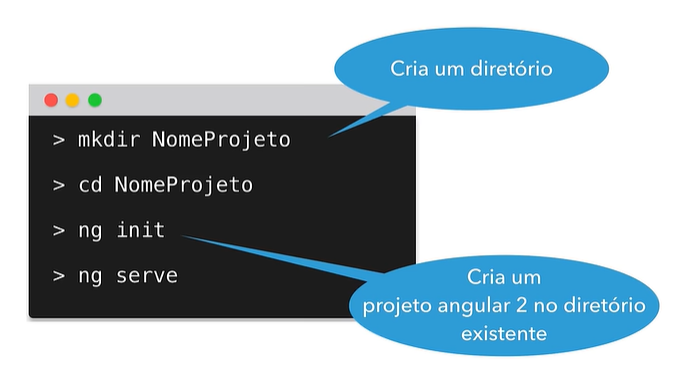

# Angular V2

## Aula 17 - Angular CLI - Instalação e criação de projetos, ng new e ng serve

O Angular CLI (Command Line Interface) é a ferramenta de linha de comando oficial fornecida pela equipe do Angular. Ele é essencial para criar, desenvolver, testar e fazer a build de aplicações Angular de forma padronizada e otimizada.

### 1. Pré-requisitos e Instalação do Angular CLI

Antes de instalar o CLI, é necessário ter o **Node.js** (com o gerenciador de pacotes npm) instalado em sua máquina.

#### Instalação Global do CLI

Para instalar a versão mais recente do Angular CLI globalmente no sistema, execute no terminal:

```bash
# Conferindo Instalação Node.js e Versão (Obrigatório Para instalar o Angular-CLI)
node -v

# Comando Instalação Angular CLI
npm install -g @angular/cli
```

### Verificando a Instalação

Para confirmar se a instalação foi concluída com sucesso e verificar as versões do Angular CLI, Node.js e sistema operacional:

```Bash
ng version
```

### 2. Criando um Novo Projeto com `ng new`

O comando `ng new` cria a estrutura completa de pastas e arquivos de uma aplicação Angular pronta para desenvolvimento.

#### Comando Básico

```Bash
ng new meu-primeiro-app

# Criação do Projeto para as Proximas Aulas
ng new diretivas --skip-install
```

Nas versões mais recentes, durante o processo de criação no terminal, o Angular CLI fará algumas perguntas interativas de configuração:

1. **Qual formato de estilos você deseja usar?**

- **Opções**: CSS, SCSS, Sass, Less. (*SCSS é o padrão mais utilizado no mercado*).

2. **Deseja habilitar Server-Side Rendering (SSR) e Static Site Generation (SSG)?**

- **Opções**: `Yes` / `No`. (*Para projetos SPA tradicionais, você pode selecionar No*).

### Opções Úteis (Flags) para o `ng new`

Você pode ignorar as perguntas interativas e personalizar a criação usando flags:

| Flag | Descrição | Exemplo de Uso |
| :--- | :--- | :--- |
| `--style` | Define o pré-processador de CSS. | `ng new app --style=scss` |
| `--routing` | Adiciona a configuração de rotas inicial. | `ng new app --routing=true` |
| `--standalone` | Força a criação de um app baseado em componentes Standalone. | `ng new app --standalone=true` |
| `--skip-install` | Cria a estrutura do projeto sem rodar o `npm install`. | `ng new app --skip-install` |
| `--dry-run` | Simula a criação do projeto mostrando os arquivos sem criá-los de fato. | `ng new app --dry-run` |

### 3. Rodando o Servidor de Desenvolvimento com `ng serve`

O comando `ng serve` compila a aplicação na memória e inicia um servidor web local. Ele possui recurso de **Live Reloading**: qualquer alteração salva no código-fonte recompila o projeto e atualiza o navegador automaticamente.

#### Como Executar

1. Entre na pasta do projeto recém-criado:

    ```bash
    cd meu-primeiro-app
    ```

2. Inicie o servidor de desenvolvimento:

    ```Bash
    ng serve
    ```

Por padrão, a aplicação estará disponível no endereço: `http://localhost:4200`

### Opções Úteis (Flags) para o `ng serve`

- Abrir o navegador automaticamente (`-o` ou `--open`):

    ```Bash
    ng serve -o
    ```

- Mudar a porta do servidor (`--port`): Útil caso a porta 4200 já esteja em uso por outra aplicação.

    ```Bash
    ng serve --port 4300
    ```

- Permitir acesso externo na rede local (`--host`): Útil para testar o sistema pelo celular ou outro dispositivo na mesma rede.

    ```Bash
    ng serve --host 0.0.0.0
    ```

### 4. Resumo de Outros Comandos Essenciais do CLI

| Comando | Descrição |
| :--- | :--- |
| `ng generate` (ou `ng g`) | Cria novos blueprints do projeto (ex: `ng g c minha-pagina` para criar um componente). |
| `ng build` | Compila a aplicação e gera os arquivos finais na pasta **dist/** para publicação em produção. |
| `ng test` | Executa os testes unitários do projeto (via Karma/Jasmine ou Vitest). |
| `ng lint` | Executa a análise estática do código para checar boas práticas. |

## Criando um projeto em um diretório existente

Comandos para criação de um projeto em um diretório existente:


