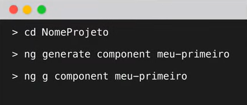
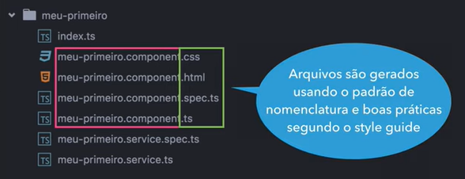
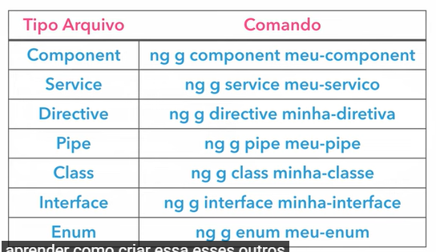

# Angular V2

## Aula 18 - Angular CLI - Criando components, services (ng generate)

O comando `ng generate` (ou a versão simplificada `ng g`) é um dos recursos mais poderosos do Angular CLI. Ele gera arquivos automaticamente seguindo os padrões oficiais de arquitetura, convenções de nomenclatura e boas práticas, criando também os arquivos de testes unitários (.spec.ts) e registrando o elemento onde for necessário.

### 1. Criando Componentes com `ng g c`

Para criar um novo componente visual na aplicação:

#### Comando Básico

```Bash
ng g c nome-do-componente
# ou completo: ng generate component nome-do-componente
```

- **Imagem do Exemplo Apresentado em Aula**

    

#### Exemplo de Uso

```Bash
ng g c features/user-profile

# Comando executado para criação de Componente para as proximas aulas
ng generate component diretiva-ngif
```

#### O que este comando faz?

1. Cria a pasta `src/app/features/user-profile/`.
2. Gera o arquivo de classe TypeScript (`user-profile.component.ts`).
3. Gera o arquivo de template HTML (`user-profile.component.html`).
4. Gera o arquivo de estilos SCSS/CSS (`user-profile.component.scss`).
5. Gera o arquivo de testes unitários (`user-profile.component.spec.ts`).



### Flags Principais para Componentes

| Flag | Descrição | Exemplo de Uso |
| :--- | :--- | :--- |
| `--flat` | Cria os arquivos sem gerar uma nova subpasta. | `ng g c button --flat` |
| `--inline-template` (ou `-t`) | Coloca o HTML direto no arquivo `.ts` (Template Inline). | `ng g c header -t` |
| `--inline-style` (ou `-s)` | Coloca os estilos direto no arquivo `.ts` (Style Inline). | `ng g c header -s` |
| `--skip-tests` | Não gera o arquivo de testes `.spec.ts`. | `ng g c card --skip-tests` |
| `--dry-run` (ou `-d`) | Simula a execução no terminal mostrando quais arquivos seriam criados sem alterar o disco. | `ng g c footer -d` |

### 2. Criando Serviços com `ng g s`

Serviços encapsulam lógica de negócios, chamadas HTTP e gerenciamento de estado.

#### Comando Básico

```Bash
ng g s services/nome-do-servico
# ou completo: ng generate service services/nome-do-servico
```

#### Exemplo de Uso

```Bash
ng g s core/services/auth

# Comando executado para criação de Componente para as proximas aulas
ng generate service diretiva-ngif/diretiva-if
```

#### O que este comando faz?

1. Cria o arquivo `auth.service.ts` na pasta `src/app/core/services/`.
2. Cria o arquivo de testes `auth.service.spec.ts`.
3. Injeta automaticamente a anotação `@Injectable({ providedIn: 'root' })`, tornando o serviço disponível em toda a aplicação como *Singleton*.

### 3. Gerando Outros Elementos Essenciais da Aplicação

O `ng generate` suporta diversos outros *blueprints* nativos do Angular:

```bash
ng generate <blueprint> <nome>
```

| Blueprint | Atalho | Comando Exemplo | Descrição |
| :--- | :--- | :--- | :--- |
| Interface | `i` | `ng g i models/user` | Cria contratos TypeScript para tipagem de dados (`user.model.ts`). |
Guard | `g` | `ng g g guards/auth` | Cria um guard de rota (ex: `CanActivateFn`) para proteção de páginas.
Interceptor | — | `ng g interceptor core/jwt` | Cria um interceptador HTTP funcional para anexar tokens/headers. |
| Pipe | `p` | `ng g p shared/pipes/cpf` | Cria um pipe customizado para formatação de dados no template. |
Directive | `d` | `ng g d shared/directives/highlight` | Cria uma diretiva de atributo/comportamento para alterar elementos do DOM. |
| Enum | `e` | `ng g e enums/order-status` | Cria um conjunto de constantes nomeadas TypeScript. |



### 4. Dica de Produtividade: O Atalho `dry-run`

Antes de criar estruturas grandes ou complexas, você pode usar a flag `-d` (`--dry-run`) para testar o caminho das pastas e os nomes gerados sem riscar o seu repositório:

```Bash
ng g c features/dashboard/components/kpi-card -d
```

        Saída do Terminal:
        CREATE src/app/features/dashboard/components/kpi-card/kpi-card.component.scss
        CREATE src/app/features/dashboard/components/kpi-card/kpi-card.component.html
        CREATE src/app/features/dashboard/components/kpi-card/kpi-card.component.spec.ts
        CREATE src/app/features/dashboard/components/kpi-card/kpi-card.component.ts
        NOTE: The --dry-run flag means no changes were made.

