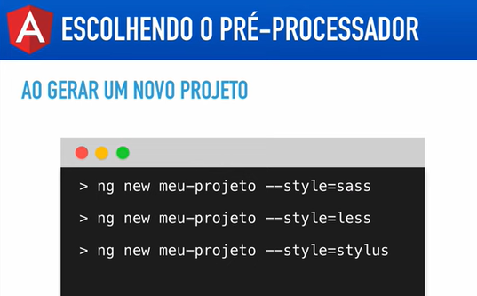
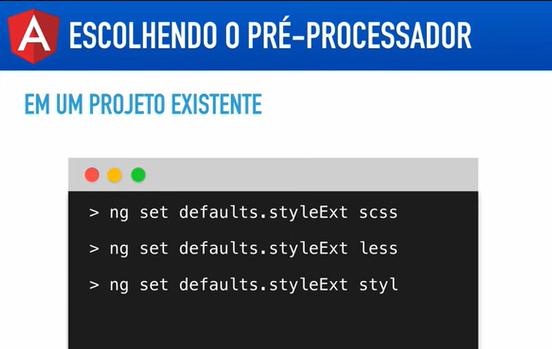

# Angular V2

## Aula 19 - Angular CLI - Usando pré-processadores (Sass, Less, Stylus)

O Angular CLI possui suporte nativo para os principais pré-processadores CSS: Sass/SCSS, Less e Stylus.

### 1. Criando um Novo Projeto com Pré-processador

Ao criar um novo projeto, você pode definir o formato dos estilos diretamente pelo terminal via flag `--style`:

```Bash
# SCSS (Sass com sintaxe CSS estendida - mais comum)
ng new meu-projeto --style=scss

# Sass (Sass com sintaxe de indentação/sem chaves)
ng new meu-projeto --style=sass

# Less
ng new meu-projeto --style=less

# Stylus
ng new meu-projeto --style=stylus
```

- **Ilustração dos comandos apresentados**



Se você executar apenas `ng new meu-projeto`, o CLI fará uma pergunta interativa para você escolher qual pré-processador deseja utilizar.

### 2. Configurando em um Projeto Existente

Se o seu projeto já existe e usa CSS padrão, você pode alterar a configuração global para que novos componentes já sejam criados com o formato do pré-processador escolhido.

#### Opção A: Usando o comando `ng config`

Execute o comando correspondente no terminal:

```Bash
# Para SCSS
ng config schematics.@schematics/angular:component.style scss

# Para Less
ng config schematics.@schematics/angular:component.style less

# Para Stylus
ng config schematics.@schematics/angular:component.style stylus
```

- Na versão 2 do angular pela ilustração apresentada a configuração era realizada pelos comandos ilustrados na imagem:

O comando `ng set` e a chave `styleExt` pertenciam às versões antigas do Angular CLI (época do arquivo `.angular-cli.json`, v1 até a v5). A partir do Angular 6, o arquivo de configuração mudou para `angular.json` e a sintaxe para alterar configurações Globais passou a usar o `ng config`.  Além disso, a partir do Angular 9, a propriedade `styleext` foi renomeada para apenas `style`.



```bash
# Comando existente para as versões v1 até a v5 
ng set defaults.styleExt scss
```

Após executar o comando:

1. Renomear o arquivo manualmente de `app.component.css` para `app.component.scss`
2. Atualizar no `app.component.ts` @Component -> styleUrls: ['./app.component.scss']

Para os novos componentes criados já será respeitado a extenção escolhida...

#### Opção B: Alterando diretamente o `angular.json`

No arquivo `angular.json`, atualize as seções `schematics` e `styles`:

```JSON
{
  "projects": {
    "meu-projeto": {
      "schematics": {
        "@schematics/angular:component": {
          "style": "scss"
        }
      },
      "architect": {
        "build": {
          "options": {
            "styles": [
              "src/styles.scss"
            ]
          }
        }
      }
    }
  }
}
```

    **Nota**: Lembre-se de renomear o arquivo global de estilos de `src/styles.css` para `src/styles.scss` (ou `.less` / `.styl`).

### 3. Convertendo Componentes Existentes

Para componentes já criados no projeto:

1. Renomeie o arquivo de estilo do componente (ex: de `app.component.css` para `app.component.scss`).
2. No arquivo TypeScript do componente (`app.component.ts`), atualize a propriedade `styleUrl` ou `styleUrls`:

```TypeScript
@Component({
  selector: 'app-root',
  templateUrl: './app.component.html',
  styleUrl: './app.component.scss' // Atualize a extensão aqui
})
export class AppComponent {}
```

### 4. Recursos Úteis e Importações

#### Incluir Diretórios Globais de Estilos (includePaths)

Caso queira importar arquivos de estilos globais (como variáveis, mixins ou funções) sem usar caminhos relativos longos (ex: `../../styles/variables`), configure o `includePaths` no `angular.json`:

```JSON
"options": {
  "styles": [
    "src/styles.scss"
  ],
  "stylePreprocessorOptions": {
    "includePaths": [
      "src/styles/abstracts"
    ]
  }
}
```

Dessa forma, em qualquer componente você pode importar arquivos diretamente:

```SCSS
// Em qualquer componente.component.scss
@use 'variables' as *;
```