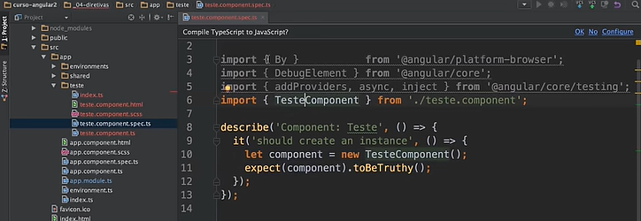

# Angular V2

## Aula 20 - Angular CLI - ng lint, ng test, ng e2e

Além do desenvolvimento e da geração de código, o Angular CLI oferece comandos nativos para qualidade de código, testes unitários e testes de ponta a ponta (E2E).

### 1. ng lint — Análise Estática de Código

O comando ng lint analisa o código-fonte em busca de erros de sintaxe, más práticas, violações de convenções de estilo de código e potenciais problemas de execução antes mesmo do código ser compilado.

```Bash
ng lint
```

Saída caso todos os arquivos estejam OK, mas infelizmente as observações apresentadas no código no conteúdo apresentado não tiveram o mesmo comportamento no caso dos imports.

```text
All files pass linting.
```

#### Contexto das versões modernas do Angular

Historicamente, o Angular utilizava o `TSLint`. No entanto, o `TSLint` foi descontinuado. Hoje, o Angular utiliza oficialmente o `ESLint` através do pacote mantido pela comunidade `@angular-eslint`.

#### Como adicionar o `ESLint` a um projeto Angular

Se o comando `ng lint` não estiver configurado no seu projeto, você pode adicioná-lo executando:

```Bash
ng add @angular-eslint/schematics
```

#### Flags Úteis do ng lint

| Flag | Descrição |
| :--- | :--- |
| `--fix` | Corrige automaticamente todos os avisos e erros formatáveis no código. |
| `--format` | "Define o formato de saída dos resultados no terminal (ex: json, stylish)." |

### 2. `ng test` — Testes Unitários

O comando `ng test` executa a suíte de testes unitários (arquivos `.spec.ts`) da aplicação.

```Bash
ng test
```



#### Como Funciona

- **Modo padrão (Watch Mode)**: O comando compila os testes e abre o test runner. Cada alteração salva em qualquer arquivo re-executa os testes automaticamente.
- **Projetos Recentes/Modernos**: O Angular adicionou suporte nativo ao Vitest ou ao Karma configurado via arquivo angular.json.

#### Flags Úteis do `ng test`

| Flag | Descrição |
| :--- | :--- |
| `--code-coverage` | Gera um relatório visual de cobertura de código (na pasta /coverage). |
| `--no-watch` ou `--watch=false` | Roda os testes apenas uma vez e encerra o processo (ideal para pipelines de CI/CD). |
| `--browsers` | Define o navegador de execução (ex: `--browsers=ChromeHeadless` para CI/CD sem tela). |
| `--include` | Executa apenas um arquivo ou padrão específico (ex: n`g test --include=**/user.service.spec.ts`). |

### 3. `ng e2e` — Testes de Ponta a Ponta (End-to-End)

O comando `ng e2e` executa testes que simulam o comportamento do usuário final interagindo com a aplicação no navegador (clicando em botões, preenchendo formulários e navegando entre páginas).

```Bash
ng e2e
```

#### Evolução das Ferramentas de E2E no Angular

- **Antigamente (Angular v2 ao v11)**: O Angular vinha por padrão com o Protractor.
- **Moderno (Atual)**: O Protractor foi descontinuado pela equipe do Angular. O ecossistema agora suporta e recomenda ferramentas modernas como **Cypress** ou **Playwright**.

#### Como Configurar Cypress ou Playwright

Para adicionar uma ferramenta **E2E** moderna que se integra ao comando `ng e2e`, utilize o `ng add`:

```Bash
# Para adicionar o Cypress
ng add @cypress/schematic

# Para adicionar o Playwright
ng add @playwright/schematic
```

Após a instalação, ao digitar `ng e2e`, o CLI acionará a ferramenta escolhida automaticamente.

## Resumo dos Comandos

| Comando | Finalidade | Ferramenta Padrão Recomendada |
| :--- | :--- | :--- |
| `ng lint` | Garantir padrões de código e detectar erros | ESLint (`@angular-eslint`) |
| `ng test` | "Testar componentes |  serviços e funções isoladas" | Vitest / Karma |
| `ng e2e` | Testar fluxos completos da aplicação no navegador | Cypress / Playwright |