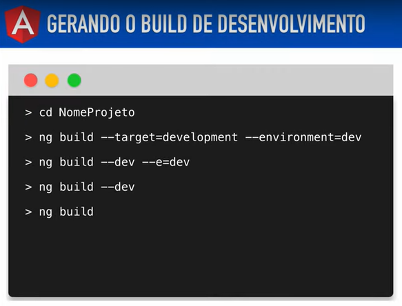
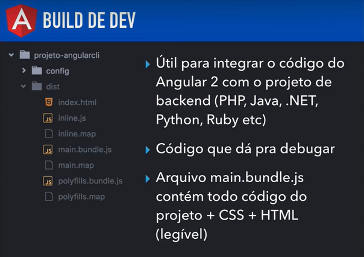
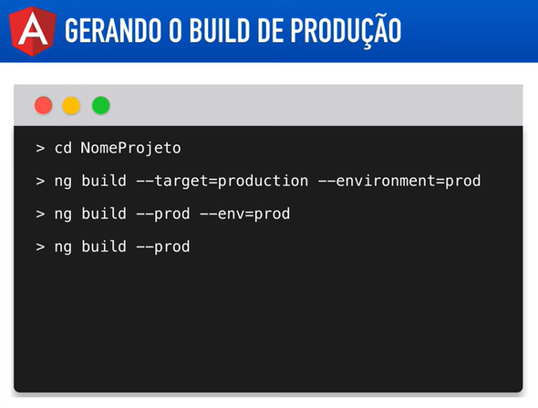
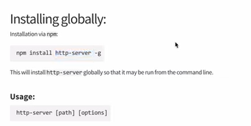

# Angular V2

## Aula 22 - Angular CLI - Fazendo build Desenvolvimento, Producação

O processo de build no Angular pega todo o seu código em TypeScript, HTML, CSS (ou SCSS) e o converte para arquivos estáticos em JavaScript puro (ES), HTML e CSS, prontos para serem interpretados por qualquer navegador.

O Angular CLI lida com isso de forma automatizada, mas os objetivos e comportamentos são completamente diferentes se você está em ambiente de Desenvolvimento ou Produção.

### 1. Build de Desenvolvimento (`Development`)

O build de desenvolvimento é focado em velocidade e depuração. Ele é otimizado para que você possa alterar seu código e ver os resultados instantaneamente.

#### Características Principais:

- **Source Maps Ativos**: Gera arquivos que mapeiam o JavaScript compilado de volta para o seu código original em TypeScript, facilitando a depuração no *DevTools* do navegador.
- **Sem Minificação**: Os arquivos JavaScript e CSS não são compactados nem minificados, mantendo os nomes de variáveis e funções legíveis.
- **Compilação Rápida**: Prioriza o tempo de compilação em vez da otimização do tamanho dos arquivos.
- **Verificações Extras**: O Angular executa rotinas de verificação adicionais em tempo de execução para ajudar a capturar bugs de ciclo de vida (como o erro `ExpressionChangedAfterItHasBeenCheckedError`).

### Comandos Comuns:

```Bash
# Sobe um servidor local (lite-server) na porta 4200 com Live Reload
ng serve

# Apenas gera os arquivos na pasta /dist sem subir o servidor
ng build --configuration=development
```





### 2. Build de Produção (Production)

O build de produção é focado em performance, segurança e tamanho reduzido. O objetivo é fazer a aplicação carregar o mais rápido possível para o usuário final.

#### Otimizações Realizadas Automaticamente:

- **Tree Shaking**: Remove todo o código morto ou bibliotecas importadas que não estão sendo ativamente utilizadas na aplicação.
- **AOT (Ahead-of-Time Compilation)**: Compila os templates HTML e TypeScript do Angular antes de enviar ao navegador, acelerando a renderização inicial.
- **Minificação e Uglification**: Reduz o tamanho de arquivos apagando espaços em branco, comentários e renomeando variáveis para nomes curtos (ex: `let usuarioLogado` vira `let a`).
- **Bundle Splitting & Lazy Loading**: Divide o código em blocos menores (*chunks*). O navegador baixa apenas o que é estritamente necessário para a página atual.
- **Cache Busting (Hashing)**: Adiciona um hash único ao nome de cada arquivo gerado (ex: `main.a4f91b2c.js`). Quando você publicar uma versão nova, o navegador do usuário saberá que precisa baixar o arquivo atualizado em vez de usar a versão em cache.

#### Comandos Comuns:

```Bash
# Gera os arquivos otimizados prontos para publicação na pasta /dist
ng build

# Em versões mais antigas do Angular (anterior ao v12), usava-se:
ng build --prod
```




### 3. Gerenciando Ambientes (Environments)

Para alternar variáveis como URLs de API, chaves de API e sinalizadores de debug entre dev e prod, o Angular utiliza os arquivos de **environment**.

#### Estrutura típica de arquivos:
`src/environments/environment.ts` (Desenvolvimento)

`src/environments/environment.prod.ts` (Produção)

#### Exemplo de configuração:

`environment.ts` (Dev):

```TypeScript
export const environment = {
  production: false,
  apiUrl: 'http://localhost:3000/api'
};
```

`environment.prod.ts` (Prod):

```TypeScript
export const environment = {
  production: true,
  apiUrl: 'https://api.minhaempresa.com'
};
```

#### No seu código (Componente ou Serviço):

```TypeScript
import { environment } from '../environments/environment';

@Injectable({ providedIn: 'root' })
export class ProdutoService {
  private apiUrl = `${environment.apiUrl}/produtos`;
}
```

Como o Angular troca os arquivos? No arquivo `angular.json`, a seção `fileReplacements` mapeia para substituir o arquivo `environment.ts` pelo `environment.prod.ts` automaticamente quando a configuração de produção é acionada.

## Difereça Arquivos Gerados na Build Dev X Prod

Ao executar o build para Desenvolvimento e para Produção, o código gerado na pasta `dist/` assume formatos completamente diferentes.

Abaixo está o detalhamento prático do que muda na estrutura, nos nomes e no conteúdo desses arquivos.

### 1. Visão Geral da Pasta `/dist`

Se você comparar a pasta de saída de cada build, a diferença visual é imediata:

```Plaintext
📁 DIST - DESENVOLVIMENTO                 📁 DIST - PRODUÇÃO
└── 📁 meu-projeto/                       └── 📁 meu-projeto/
    ├── browser/                              ├── browser/
    │   ├── main.js (5 MB)                    │   ├── main-A7B8C9D0.js (250 KB)
    │   ├── polyfills.js (500 KB)             │   ├── polyfills-E1F2G3H4.js (35 KB)
    │   ├── styles.css (300 KB)               │   ├── styles-X9Y8Z7W6.css (40 KB)
    │   ├── main.js.map                       │   ├── favicon.ico
    │   ├── polyfills.js.map                  │   └── index.html (minificado)
    │   ├── styles.css.map                    │
    │   ├── favicon.ico                       └── (Sem arquivos .map por padrão)
    │   └── index.html (formatado)
```

### 2. As 5 Principais Diferenças nos Arquivos

#### 1. Hashing nos Nomes dos Arquivos (Cache Busting)

- **Desenvolvimento (`main.js`, `styles.css`)**: Os nomes dos arquivos são fixos e previsíveis.
- **Produção (`main-A7B8C9D0.js`)**: O Angular adiciona um hash de conteúdo (código alfanumérico) ao nome do arquivo.

    **Por que isso é feito?** Se você subir uma versão nova para o servidor, o navegador do usuário entenderá que o nome mudou e baixará o arquivo atualizado, evitando problemas com arquivos antigos salvos no cache do navegador.

#### 2. Presença de Arquivos Source Map (.map)

- **Desenvolvimento (Presente)**: São gerados arquivos .map (ex: main.js.map). Eles "traduzem" o código JavaScript compilado de volta para o TypeScript original ao abrir o DevTools (F12) do navegador.
- **Produção (Ausente por padrão)**: Arquivos .map não são gerados. Isso reduz o tamanho total transferido e impede que usuários finais tenham acesso direto ao código-fonte TypeScript da aplicação.

#### 3. Minificação e "Uglification"

Ao abrir o conteúdo do arquivo main.js, a diferença de formatação é brutal:

- **Desenvolvimento**: O código mantém espaçamentos, quebras de linha e nomes de variáveis compreensíveis.

    ```JavaScript
    // Desenvolvimento
    function calcularTotal(precoProduto, quantidade) {
        return precoProduto * quantidade;
    }
    ```

- **Produção**: O código é compactado em pouquíssimas linhas contínuas. Nomes de variáveis e funções são encurtados para uma única letra.

    ```JavaScript
    // Produção
    function a(b,c){return b*c;}
    ```

#### 4. Remoção de Código Morto (Tree Shaking)

- **Desenvolvimento**: Inclui funções, módulos e bibliotecas completas para facilitar a depuração durante os testes.
- **Produção**: O processo de Tree Shaking analisa a aplicação e joga fora qualquer trecho de código ou biblioteca importada que não esteja sendo usada ativamente.

#### 5. Compilação do HTML/CSS dos Componentes (AOT vs JIT)

- **Desenvolvimento**: Historicamente usava JIT (Just-In-Time), onde o navegador recebia partes do código para processar o template HTML em tempo de execução (hoje o Angular padronizou o AOT, mas sem otimizações agressivas).
- **Produção (AOT - Ahead-Of-Time)**: Todos os componentes HTML e CSS são pré-compilados em instruções JavaScript puras antes de irem para o servidor. O arquivo index.html final vem completamente limpo e minificado.

## Executar localmente com `http-server`

Para testar localmente os arquivos gerados no build do Angular (pasta `dist/`), o `http-server` é uma das ferramentas mais simples e populares. Ele simula um servidor web real rodando no seu computador.

Abaixo está o passo a passo completo para instalar e executar:

### Passo 1: Gerar o build de produção

Antes de mais nada, garanta que você gerou a pasta dist atualizada com o build de produção:

```Bash
ng build
```

### Passo 2: Opções para executar o http-server

Você tem duas formas de usar o `http-server`: sem instalar nada permanentemente (usando `npx`) ou instalando globalmente via npm.



#### Opção A: Executar sem instalar (Recomendado)

O npx baixa e executa a ferramenta de forma temporária:

```Bash
npx http-server dist/meu-projeto/browser -c-1 --cors -o
```

#### Opção B: Instalar globalmente

Se preferir ter o comando sempre disponível no seu terminal:

1. Instale globalmente:

    ```Bash
    npm install -g http-server
    ```

2. Execute apontando para a pasta do build:

    ```Bash
    http-server dist/meu-projeto/browser -c-1 --cors -o
    ```

    **Atenção ao caminho**: Substitua meu-projeto pelo nome do seu projeto Angular (verifique o nome correto dentro da pasta `dist/`). Em versões recentes do Angular, a saída fica dentro de `dist/<nome-do-projeto>/browser`.

### Entendendo os Parâmetros Utilizados

| Parâmetro | O que faz |
| :--- | :--- |
| `dist/meu-projeto/browser` | Define a pasta raiz que o servidor vai servir na web. |
| `-c-1` | Desabilita o cache do navegador (`cache = -1`). Essencial para você testar alterações sem o navegador segurar versões velhas dos arquivos. |
| `--cors` | "Habilita requisições CORS o que ajuda caso seu app faça chamadas para APIs em domínios/portas diferentes." |
| `-o` | Abre automaticamente a página no seu navegador padrão ao iniciar o servidor. |

### Dica Crucial para SPAs (Suporte a Rotas do Angular)

Se a sua aplicação possui rotas (ex: `http://localhost:8080/login` ou `http://localhost:8080/dashboard`) e você recarregar a página (F5) em uma dessas sub-rotas, o **http-server** padrão retornará um erro 404 Not Found.

Isso acontece porque o servidor procura por uma pasta `/login` ou `/dashboard` física que não existe no build estático.

#### Como resolver isso no http-server?

Adicione a opção `--proxy` redirecionando para o `index.html`:

```bash
npx http-server dist/meu-projeto/browser -c-1 --cors --proxy http://localhost:8080? -o
```

    O que a flag `--proxy` faz? Quando uma rota não for encontrada como arquivo físico, o servidor redireciona o tráfego para o `index.html`, permitindo que o roteador do Angular assuma a navegação no navegador.