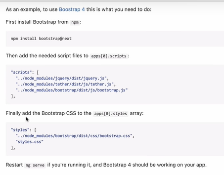
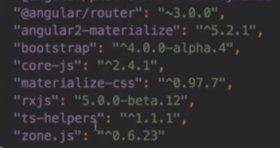
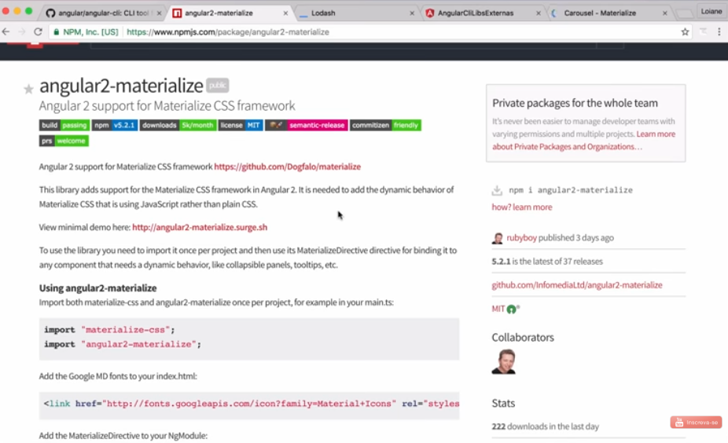

# Angular V2

## Aula 23 - Angular CLI - Instalando Bibliotecas (bootstrap, materialize, lodash, jquery, etc)

Para esta aula, foi criado um novo projeto.

```bash
ng new projeto-libs-externas --skip-install
```

No Angular, existem duas abordagens principais para instalar bibliotecas de terceiros:

1. **Bibliotecas Nativas / Adaptadas para Angular**: Têm componentes prontos para o ciclo de vida do Angular (sem dependência do jQuery/DOM direto). **É a abordagem altamente recomendada**.
2. **Bibliotecas JavaScript / CSS Puras (Vanilla)**: Utilitários ou bibliotecas legadas que precisam ser incluídas no arquivo `angular.json` ou importadas diretamente no TypeScript.

### 1. Bootstrap

Existem duas formas de integrar o Bootstrap: usando apenas o CSS puro ou usando uma biblioteca de componentes Angular que dispensa o uso do jQuery.

#### Opção A: Apenas o CSS do Bootstrap (Mais Simples)

1. Instale o pacote via npm:

    ```Bash
    # Instalar Versão Atual Bootstrap
    npm install bootstrap

    # Instalar a Versão Bootstrap Compatível com Angular V2
    ## Utilizando a mesma versão não funcionou
    ## npm install bootstrap@4.0.0-alpha.4 --save
    npm install bootstrap@4.6.0 jquery@3.5.1 popper.js@1.16.1 --save
    ```



2. Adicione o CSS ao `angular.json`:

    No arquivo `angular.json`, localize o array styles em `architect -> build -> options -> styles` e adicione o caminho do Bootstrap:

    ```JSON
    "styles": [
        "../node_modules/bootstrap/dist/css/bootstrap.css",
        "src/styles.css"
    ],
    ```

#### Configurar os Arquivos no `angular-cli.json`

No Angular v2, o arquivo de configuração global do CLI era chamado `angular-cli.json` (e não angular.json, que passou a ser adotado a partir da versão 6).

Abra o arquivo `angular-cli.json` na raiz do projeto, localize o array apps e adicione os caminhos dos estilos e scripts dentro das seções "**styles**" e "**scripts**":

```json
      "styles": [
        "../node_modules/bootstrap/dist/css/bootstrap.min.css",
        "styles.css"
      ],
      "scripts": [
        "../node_modules/jquery/dist/jquery.min.js",
        "../node_modules/popper.js/dist/umd/popper.min.js",
        "../node_modules/bootstrap/dist/js/bootstrap.min.js"
      ],
```

        Atenção aos Caminhos: No Angular CLI v2 (angular-cli.json), os caminhos das rotas em styles e scripts devem começar com ../node_modules/, pois são resolvidos a partir da pasta src/.

[Documentação Bootstrap 4.6](https://getbootstrap.com/docs/4.6/components)

#### Opção B: ng-bootstrap (Componentes Nativos em Angular - Recomendado)

Se você precisa de componentes interativos (Modais, Dropdowns, Carrossel, Tooltips) sem depender do JS/jQuery original:

1. Adicione via Angular Schematics:

```Bash
ng add @ng-bootstrap/ng-bootstrap
```

    *Este comando já instala as dependências necessárias e ajusta as configurações do projeto automaticamente.*

### 2. Lodash (Biblioteca de Utilitários)

O Lodash é uma biblioteca puramente de funções utilitárias em JavaScript. Para usá-la no TypeScript com suporte a autocompletar e verificação de tipos, instale também as definições de tipo (`@types/lodash`).

1. Instale a biblioteca e as tipagens:

```Bash
npm install --save lodash@4.14.2
npm install --save-dev @types/lodash@4.14.100
```

2. Como usar no código (.ts):

    Para importar apenas a função que você precisa (melhor para o Tree Shaking no build de produção):

    ```TypeScript
    import cloneDeep from 'lodash/cloneDeep';

    const objetoOriginal = { a: 1, b: { c: 2 } };
    const copiaProfunda = cloneDeep(objetoOriginal);
    ```

    Ou para importar todo o lodash (completo):

    ```TypeScript
    import * as _ from 'lodash';
    
    const arrayUnico = _.uniq([1, 2, 2, 3, 4, 4]);
    ```

### 3. Materialize CSS

No ecossistema Angular, você tem duas opções para trabalhar com o visual Material Design:

#### Installing & configuring angular2-materialize in projects created with the Angular CLI

```bash
npm install materialize-css --save
npm install materialize-css@0.97.7 --save

npm install angular2-materialize --save
npm install angular2-materialize@5.2.1 --save
```



jQuery 2.2 and Hammer.JS are required

```bash
npm install jquery@^2.2.4 --save
npm install hammerjs --save
```

Edit the angular-cli.json :

Go to section apps and find styles array inside it (with only styles.css value by default), add the following line inside array before any styles:

```json
  "../node_modules/materialize-css/dist/css/materialize.css"
```

Go to section apps and find scripts array inside it, and add the following lines inside array

```json
  "../node_modules/jquery/dist/jquery.js",
  "../node_modules/hammerjs/hammer.js",
  "../node_modules/materialize-css/dist/js/materialize.js"
```

Add to the top of `app.module.ts`

```typescript
import { MaterializeModule } from 'angular2-materialize';
```

Add MaterializeModule inside imports array of @NgModule decorator in app.module.ts

Add this line to header of index.html

```html
<link href="http://fonts.googleapis.com/icon?family=Material+Icons" rel="stylesheet">
```

[Documentação Angular2-Materialize](https://www.npmjs.com/package/angular2-materialize)



#### Opção A: Angular Material (Oficial do Google - Recomendado)

Em vez da biblioteca Materialize legada, a equipe do Angular mantém o Angular Material, totalmente otimizado para o framework.

1. Instalação simplificada:

    ```Bash
    ng add @angular/material
    ```

    O CLI fará perguntas interativas sobre o tema de cores, animações e fontes de ícones do Google.

#### Opção B: Materialize CSS Legado

Se você realmente precisa usar o Materialize CSS:

1. Instale os pacotes:

    ```Bash
    npm install materialize-css@next
    ```

2. Adicione CSS e JS ao angular.json:

    ```JSON
    "styles": [
    "node_modules/materialize-css/dist/css/materialize.min.css",
    "src/styles.css"
    ],
    "scripts": [
    "node_modules/materialize-css/dist/js/materialize.min.js"
    ]
    ```

### 4. jQuery (E por que você deve evitar)

**Aviso de Boa Prática**: *O Angular possui seu próprio mecanismo para manipular a árvore do DOM (através da diretiva `ElementRef` e do mecanismo de detecção de mudanças). O uso de jQuery dentro do Angular quebra essa integração, pode causar problemas de performance e gerar bugs de sincronização de dados*.

Se você realmente precisa integrar um plugin antigo baseado em jQuery:

1. Instale o jQuery e suas tipagens:

    ```Bash
    npm install jquery
    npm install --save-dev @types/jquery
    ```

2. Adicione ao angular.json:

    ```JSON
    "scripts": [
    "node_modules/jquery/dist/jquery.min.js"
    ]
    ```

3. Importe no componente TypeScript:

    ```TypeScript
    import { Component, OnInit, ElementRef } from '@angular/core';
    import * as $ from 'jquery';

    @Component({
    selector: 'app-exemplo',
    template: `<div id="meu-elemento">Olá jQuery</div>`
    })
    export class ExemploComponent implements OnInit {
    ngOnInit() {
        $('#meu-elemento').hide().fadeIn('slow');
    }
    }
    ```