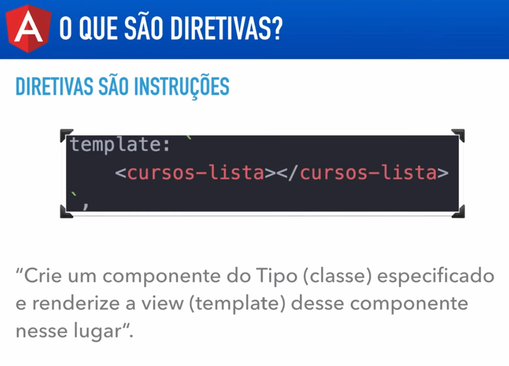

# Angular V2

## Aula 24 - Introdução e Tipos de Diretivas no Angular 2

As Diretivas são um dos pilares mais importantes do Angular. Elas são **instruções** aplicadas a elementos do DOM para modificar sua aparência, comportamento ou até mesmo a estrutura da árvore HTML.

No Angular, um Componente é, na verdade, uma diretiva especial que possui um template HTML associado.

### Tipos de Diretivas no Angular

Existem 3 tipos principais de diretivas no Angular:

```Plaintext
               ┌────────────────────────┐
               │  Tipos de Diretivas    │
               └───────────┬────────────┘
                           │
      ┌────────────────────┼────────────────────┐
      ▼                    ▼                    ▼
┌───────────┐      ┌───────────────┐   ┌─────────────────┐
│Componentes│      │ Estruturais   │   │ De Atributo     │
└───────────┘      └───────────────┘   └─────────────────┘
```

### 1. Componentes (Component Directives)

São diretivas com um template HTML e estilos associados. Todo componente é uma diretiva, mas com uma interface gráfica própria.

#### Sintaxe/Uso:

```TypeScript
@Component({
  selector: 'app-meu-componente',
  template: `<h1>Olá Mundo!</h1>`
})
export class MeuComponente {}
```



### 2. Diretivas Estruturais (Structural Directives)

Alteram a estrutura do DOM, adicionando, removendo ou manipulando elementos HTML. São facilmente identificadas pelo asterisco (*) antes do nome.

#### Principais Nativas:

- `*ngIf`: Exibe ou remove um elemento do DOM com base em uma condição booleana.
- `*ngFor`: Repete um elemento HTML para cada item de uma lista/array.
- `*ngSwitch` / `*ngSwitchCase`: Exibe elementos dinamicamente com base em múltiplos casos.

Exemplos no Template:

```HTML
<!-- *ngIf -->
<div *ngIf="usuarioLogado">
  Bem-vindo, {{ usuario.nome }}!
</div>

<!-- *ngFor -->
<ul>
  <li *ngFor="let item of listaDeItens">
    {{ item }}
  </li>
</ul>
```


### 3. Diretivas de Atributo (Attribute Directives)

Alteram a aparência, estilo ou comportamento de um elemento existente no DOM, sem adicionar ou remover o elemento da árvore.

#### Principais Nativas:

- `ngClass`: Adiciona ou remove dinamicamente classes CSS.
- `ngStyle`: Aplica estilos CSS dinâmicos (inline) ao elemento.
- `ngModel`: Cria um binding bidirecional (Two-Way Data Binding) em elementos de formulário.

Exemplos no Template:

```HTML
<!-- ngClass -->
<div [ngClass]="{ 'ativo': estaAtivo, 'inativo': !estaAtivo }">
  Status do Usuário
</div>

<!-- ngStyle -->
<p [ngStyle]="{ 'color': corDoTexto, 'font-size': '18px' }">
  Texto com cor dinâmica.
</p>

<!-- ngModel -->
<input [(ngModel)]="nomeUsuario" placeholder="Digite seu nome">
```

### Criando uma Diretiva de Atributo Customizada

Além das diretivas nativas, você pode criar suas próprias diretivas de atributo usando o decorator `@Directive`.

**Exemplo**: Diretiva que muda a cor de fundo ao passar o mouse

```TypeScript
import { Directive, ElementRef, HostListener, Renderer2 } from '@angular/core';

@Directive({
  selector: '[appHighlight]' // Nome do atributo HTML
})
export class HighlightDirective {

  constructor(private el: ElementRef, private renderer: Renderer2) {}

  @HostListener('mouseenter') onMouseEnter() {
    this.mudarCor('yellow');
  }

  @HostListener('mouseleave') onMouseLeave() {
    this.mudarCor(null);
  }

  private mudarCor(cor: string) {
    this.renderer.setStyle(this.el.nativeElement, 'backgroundColor', cor);
  }
}
```

Uso no HTML:

```HTML
<p appHighlight>
  Passe o mouse aqui para destacar!
</p>
```