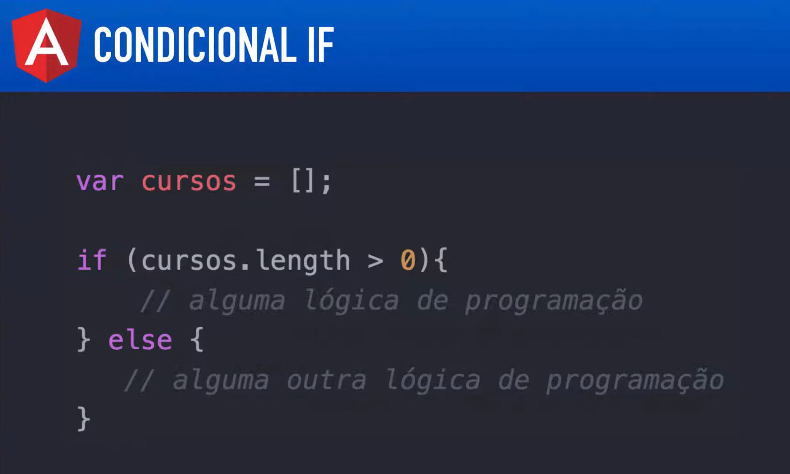
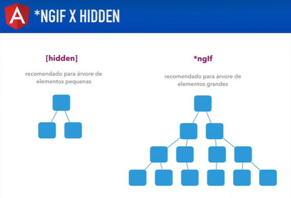

# Angular V2

## Aula 25 - Diretiva ngIf

A diretiva `*ngIf` é uma diretiva estrutural do Angular responsável por adicionar ou remover fisicamente um elemento (e seus filhos) da árvore do DOM com base em uma expressão booleana (`true` ou `false`).

### 1. Funcionamento Básico

Se a expressão for `true`, o elemento é renderizado na tela. Se for `false`, ele é totalmente removido do HTML (não fica apenas "escondido" com display: none).



Para exemplificação no projeto criado anteriormente vamos criar um novo componente

```bash
ng g c diretiva-ngif
```
#### Exemplo no Componente (.ts):

```TypeScript
import { Component } from '@angular/core';

@Component({
  selector: 'app-exemplo-ngif',
  templateUrl: './exemplo-ngif.component.html'
})
export class ExemploNgIfComponent {
  mostrarMensagem: boolean = true;

  alternarVisibilidade() {
    this.mostrarMensagem = !this.mostrarMensagem;
  }
}
```

#### Exemplo no Template (.html):

```HTML
<button (click)="alternarVisibilidade()">Alternar</button>

<!-- O parágrafo só existe no DOM se mostrarMensagem for true -->
<p *ngIf="mostrarMensagem">
  Esta mensagem está visível!
</p>
```

### 2. Sintaxe no Angular v2 e v4 (Bloco else)

No Angular 2.x original, o *ngIf aceitava apenas expressões condicionais diretas. Se você precisava de um comportamento de "se / senão", tinha que duplicar a condição:

```HTML
<!-- Padrão no Angular 2 -->
<div *ngIf="usuarioLogado">Bem-vindo de volta!</div>
<div *ngIf="!usuarioLogado">Por favor, faça login.</div>
```

A partir do Angular 4.0 (que é a versão usada no seu projeto), foi introduzida a sintaxe com else utilizando o elemento <ng-template> e variáveis de referência local (#):

```HTML
<!-- Se usuarioLogado for true, exibe esta div. Se for false, chama o bloco #blocoDeslogado -->
<div *ngIf="usuarioLogado; else blocoDeslogado">
  <span>Bem-vindo, Usuário!</span>
</div>

<!-- Bloco alternativo renderizado quando a condição for false -->
<ng-template #blocoDeslogado>
  <span>Por favor, faça login para continuar.</span>
</ng-template>
```

### 3. `then` e `else` Combinados

Você também pode definir dois blocos de template separados para as condições `true` e `false`:

```HTML
<div *ngIf="isCarregando; then blocoCarregando else blocoConteudo"></div>

<ng-template #blocoCarregando>
  <p>Carregando dados, aguarde...</p>
</ng-template>

<ng-template #blocoConteudo>
  <p>Dados carregados com sucesso!</p>
</ng-template>
```

### 4. O que o Asterisco (*) Faz por Baixo dos Panos?

O asterisco * é um "açúcar sintático" (syntactic sugar). Quando você escreve:

```HTML
<p *ngIf="condicao">Texto</p>
```

O compilador do Angular transforma internamente esse código em um `<ng-template>` usando a sintaxe de propriedade `[ngIf]`:

```HTML
<ng-template [ngIf]="condicao">
  <p>Texto</p>
</ng-template>
```

### 5. Diferença entre `*ngIf `e `[hidden]`

É muito comum confundir o *ngIf com a propriedade CSS [hidden]:

| Recurso | O que faz com o DOM? | Impacto no Desempenho |
| :--- | :--- | :--- |
| `*ngIf="condicao"` | Destrói e recria o elemento e seus componentes filhos na árvore DOM. | Melhor para economizar memória e recursos se o elemento for complexo e raramente exibido. |
| `[hidden]="!condicao"` | Mantém o elemento no DOM, apenas aplicando a regra de estilo `display: none`. | Melhor se o elemento alterna de visibilidade com muita frequência (evita recalcular o ciclo de vida). |



