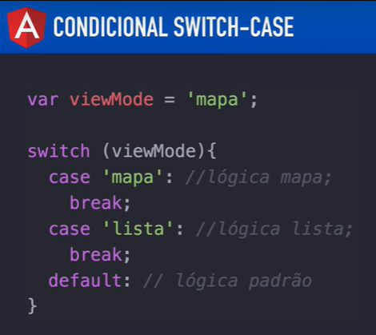

# Angular V2

## Aula 26 - Diretivas - ngSwitch, ngSwitchCase e ngSwitchDefault

A diretiva `ngSwitch` no Angular é uma diretiva estrutural usada para exibir um elemento HTML específico entre várias opções possíveis, funcionando exatamente como o comando `switch` / `case` em linguagens de programação.

Ela é composta por três partes integradas:

- `[ngSwitch]`: Uma diretiva de atributo aplicada ao elemento pai para escutar uma expressão/variável.
- `*ngSwitchCase`: Uma diretiva estrutural aplicada a cada elemento filho para verificar a correspondência de um valor.
- `*ngSwitchDefault`: Uma diretiva estrutural opcional que é exibida caso nenhum *ngSwitchCase seja atendido.



```bash
# Componente criado para esta aula
ng g c diretiva-ngswitch
```

Saída Console após a execução do comando para criação do componente.

```text
  create src\app\diretiva-ngswitch\diretiva-ngswitch.component.scss
  create src\app\diretiva-ngswitch\diretiva-ngswitch.component.html
  create src\app\diretiva-ngswitch\diretiva-ngswitch.component.spec.ts
  create src\app\diretiva-ngswitch\diretiva-ngswitch.component.ts
  update src\app\app.module.ts
```

### 1. Exemplo Prático

Componente (.ts):

```TypeScript
import { Component } from '@angular/core';

@Component({
  selector: 'app-exemplo-switch',
  templateUrl: './exemplo-switch.component.html'
})
export class ExemploSwitchComponent {
  abaSelecionada: string = 'home'; // 'home', 'perfil', 'configuracoes'

  definirAba(aba: string) {
    this.abaSelecionada = aba;
  }
}
```

Template (.html):

```HTML
<!-- Botoes de Navegação -->
<button (click)="definirAba('home')">Home</button>
<button (click)="definirAba('perfil')">Perfil</button>
<button (click)="definirAba('configuracoes')">Configurações</button>
<button (click)="definirAba('invalida')">Outra</button>

<hr>

<!-- Bloco Container com ngSwitch -->
<div [ngSwitch]="abaSelecionada">

  <!-- Caso 1 -->
  <div *ngSwitchCase="'home'">
    <h3>Página Inicial</h3>
    <p>Bem-vindo à tela principal!</p>
  </div>

  <!-- Caso 2 -->
  <div *ngSwitchCase="'perfil'">
    <h3>Perfil do Usuário</h3>
    <p>Aqui estão seus dados cadastrais.</p>
  </div>

  <!-- Caso 3 -->
  <div *ngSwitchCase="'configuracoes'">
    <h3>Configurações do Sistema</h3>
    <p>Ajuste suas preferências aqui.</p>
  </div>

  <!-- Caso Padrão (Fallback) -->
  <div *ngSwitchDefault>
    <h3>Página não encontrada</h3>
    <p>Selecione uma opção válida acima.</p>
  </div>

</div>
```

### 2. Sintaxe e Detalhes Importantes

#### Utilização de Aspas Duplas e Simples

No `*ngSwitchCase`, se você estiver comparando com um valor literal do tipo texto (string), lembre-se de usar aspas simples dentro das aspas duplas (`*ngSwitchCase="'home'"`).

Se você passar sem aspas simples (`*ngSwitchCase="home"`), o Angular tentará procurar por uma propriedade chamada `home` no seu arquivo `.ts`.

```HTML
<!-- Comparando com STRING LITERAL -->
<div *ngSwitchCase="'admin'">Visão de Administrador</div>

<!-- Comparando com VARIÁVEL do componente .ts -->
<div *ngSwitchCase="tipoUsuarioAdmin">Visão de Administrador</div>

<!-- Comparando com NÚMEROS -->
<div *ngSwitchCase="1">Opção número 1</div>
```

### 3. Quando Usar ngSwitch vs *ngIf?

- Use `*ngIf`: Quando você tiver poucas condições (ex: apenas `true/false` ou `se/senão`).
- Use `ngSwitch`: Quando você tiver 3 ou mais condições possíveis para a mesma variável. O código fica muito mais limpo, legível e evita encadeamentos gigantes de `*ngIf="tipo === 'A'"`, `*ngIf="tipo === 'B'"`, `*ngIf="tipo === 'C'"`.

### 4. Comportamento no DOM

Assim como o `*ngIf`, o `*ngSwitchCase` destrói e cria elementos no DOM de forma física. Apenas o elemento correspondente ao valor atual é mantido na árvore HTML; todas as outras opções são completamente removidas, otimizando o uso de memória.