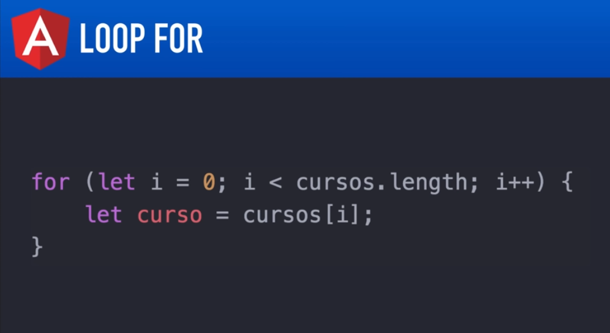

# Angular V2

## Aula 27 - Diretiva - ngFor

A diretiva `*ngFor` é uma das diretivas estruturais mais utilizadas no Angular. Ela funciona como um laço de repetição (*loop*) no HTML, iterando sobre uma lista (array) e renderizando um bloco de template para cada item.



```bash
# Componente criado para esta aula.
ng g c diretiva-ngfor
```

### 1. Sintaxe e Uso Básico

A sintaxe básica utiliza a expressão `let item of lista`:

#### Componente (`.ts`):

```TypeScript
import { Component } from '@angular/core';

@Component({
  selector: 'app-exemplo-ngfor',
  templateUrl: './exemplo-ngfor.component.html'
})
export class ExemploNgForComponent {
  cursos: string[] = ['Angular 2', 'TypeScript', 'HTML5 & CSS3', 'RxJS'];
}
```

#### Template (`.html`):

```HTML
<h3>Lista de Cursos</h3>

<ul>
  <li *ngFor="let curso of cursos">
    {{ curso }}
  </li>
</ul>
```

### 2. Iterando sobre Listas de Objetos

Na maioria das aplicações reais, você iterará sobre uma lista de objetos complexos:

#### Componente (`.ts`):

```TypeScript
alunos = [
  { id: 1, nome: 'Ana', nota: 9.5 },
  { id: 2, nome: 'Carlos', nota: 7.0 },
  { id: 3, nome: 'Beatriz', nota: 8.2 }
];
```

#### Template (`.html`):

```HTML
<table border="1">
  <thead>
    <tr>
      <th>ID</th>
      <th>Nome</th>
      <th>Nota</th>
    </tr>
  </thead>
  <tbody>
    <tr *ngFor="let aluno of alunos">
      <td>{{ aluno.id }}</td>
      <td>{{ aluno.nome }}</td>
      <td>{{ aluno.nota }}</td>
    </tr>
  </tbody>
</table>
```

### 3. Variáveis Locais Exportadas pelo `*ngFor`

O Angular disponibiliza diversas variáveis de contexto dentro da iteração que auxiliam no controle do layout:

- `index`: Retorna o índice (posição) atual do item no array (começando em 0).
- `first`: Retorna **true** se for o primeiro item da lista.
- `last`: Retorna **true** se for o último item da lista.
- `even`: Retorna **true** se o índice for par.
- `odd`: Retorna **true** se o índice for ímpar.

#### Exemplo Prático com Variáveis Locais:

```HTML
<ul>
  <li *ngFor="let curso of cursos; let i = index; let isFirst = first; let isEven = even"
      [style.backgroundColor]="isEven ? '#f2f2f2' : '#ffffff'">
    
    <!-- Exibe o índice ordenado (1, 2, 3...) -->
    <strong>#{{ i + 1 }}</strong> - {{ curso }}
    
    <!-- Tag especial para o primeiro item -->
    <span *ngIf="isFirst" style="color: green;">(Mais Recente)</span>
  </li>
</ul>
```

### 4. Otimização de Performance com `trackBy`

Por padrão, quando a lista no seu código TypeScript muda (por exemplo, ao buscar dados atualizados do servidor), o Angular destrói e recria todos os elementos HTML do `*ngFor` no **DOM**.

Se a lista for muito grande, isso causa problemas de performance e lentidão na tela. O `trackBy` instrui o Angular a recriar apenas os itens que sofreram alteração, rastreando-os por um identificador único (como o `id`).

#### Exemplo de uso do `trackBy`:

No Componente (`.ts`):

```TypeScript
export class ExemploNgForComponent {
  alunos = [ /* ... */ ];

  // Função que retorna a chave única do item
  trackByAlunos(index: number, aluno: any): number {
    return aluno.id;
  }
}
```

No Template (`.html`):

```HTML
<ul>
  <li *ngFor="let aluno of alunos; trackBy: trackByAlunos">
    {{ aluno.nome }}
  </li>
</ul>
```

#### Resumo da Sintaxe Completa

```HTML
<div *ngFor="let item of lista; let i = index; let f = first; let l = last; let e = even; let o = odd; trackBy: minhaFuncaoTrackBy">
  Item {{ i }}: {{ item.nome }}
</div>
```