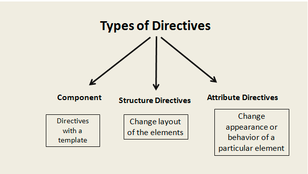

# Angular V2

## Aula 34 - Criando uma Diretiva HostListener e HostBinding

Os decoradores `@HostListener` e `@HostBinding` servem para vincular eventos e propriedades do **elemento hospedeiro** (o elemento HTML onde a diretiva está aplicada) diretamente às propriedades e métodos da classe TypeScript.


Diretivas de atributo interagem diretamente com o hospedeiro.

Para exemplificação foi criado a diretiva `highlight-mouse`.

```bash
# Criação da Diretiva
ng g d shared/highlight-mouse
```

### Conceitos Chave

- `@HostListener` **(Escutar eventos)**: Escuta eventos disparados pelo elemento hospedeiro (como `click`, `mouseover`, `keydown`) ou pela janela/documento (`window:scroll`, `document:keydown`) e executa um método da diretiva quando o evento ocorre.
- `@HostBinding` **(Vincular propriedades)**: Modifica propriedades do elemento hospedeiro (como estilos, classes CSS ou atributos) ligando-as diretamente a uma variável da classe da diretiva.

#### Exemplo Prático: Diretiva Interativa de Borda

Uma diretiva que altera a cor de fundo, a borda e a classe do elemento dinamicamente conforme o usuário interage:

```TypeScript
import { Directive, HostBinding, HostListener, Input } from '@angular/core';

@Directive({
  selector: '[appInteractiveBorder]'
})
export class InteractiveBorderDirective {
  @Input() defaultBorder = '1px solid gray';
  @Input() hoverBorder = '2px solid blue';

  // Vincula a propriedade de estilo 'border' do elemento hospedeiro
  @HostBinding('style.border') border: string = this.defaultBorder;

  // Vincula a cor de fundo do elemento hospedeiro
  @HostBinding('style.backgroundColor') backgroundColor: string = 'transparent';

  // Adiciona ou remove uma classe CSS dinamicamente
  @HostBinding('class.active-card') isActive: boolean = false;

  // Escuta o evento de entrada do mouse
  @HostListener('mouseenter') onMouseEnter() {
    this.border = this.hoverBorder;
    this.backgroundColor = '#eef6ff';
    this.isActive = true;
  }

  // Escuta o evento de saída do mouse
  @HostListener('mouseleave') onMouseLeave() {
    this.border = this.defaultBorder;
    this.backgroundColor = 'transparent';
    this.isActive = false;
  }

  // Exemplo escutando evento global do teclado (tecla ESC)
  @HostListener('document:keydown.escape', ['$event'])
  onEscapeKey(event: KeyboardEvent) {
    this.isActive = false;
    this.backgroundColor = 'transparent';
  }
}
```

Uso no Template HTML

```HTML
<!-- A diretiva manipula os estilos e eventos da div hospedeira sem poluir o componente -->
<div appInteractiveBorder defaultBorder="1px solid #ccc" hoverBorder="2px solid green">
  Passe o mouse para alterar a borda e o fundo. Pressione ESC para resetar.
</div>
```

#### Comprativo de Uso

| Decorador | Tipo de Ligação | Sintaxe Comum | Equivalente no Template |
| :--- | :--- | :--- | :--- |
| `@HostBinding` | Saída da classe → Elemento | `@HostBinding('style.color') color` | `[style.color]="color"` |
| `@HostBinding` | Classe CSS → Elemento | `@HostBinding('class.active') isActive` | `[class.active]="isActive"` |
| `@HostListener` | Evento do Elemento → Método | `@HostListener('click', ['$event'])` | `(click)="onClick($event)"` |