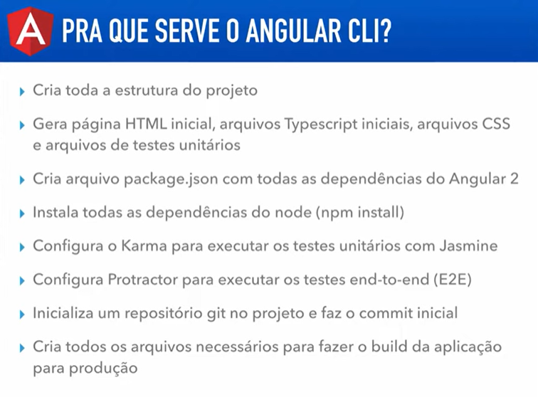
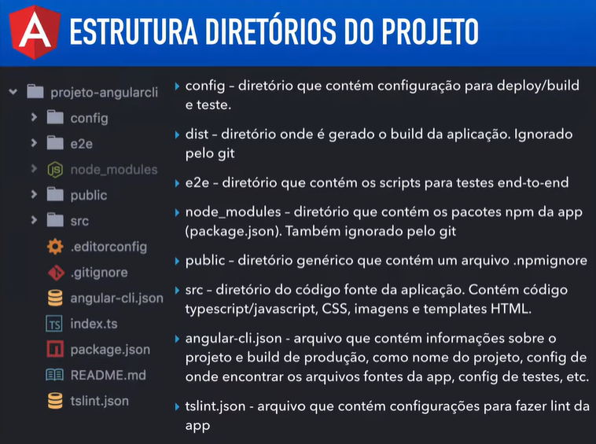
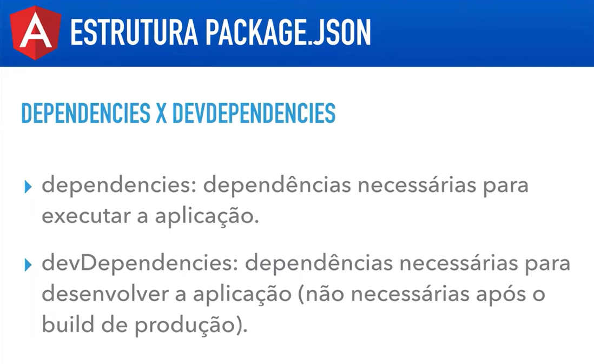
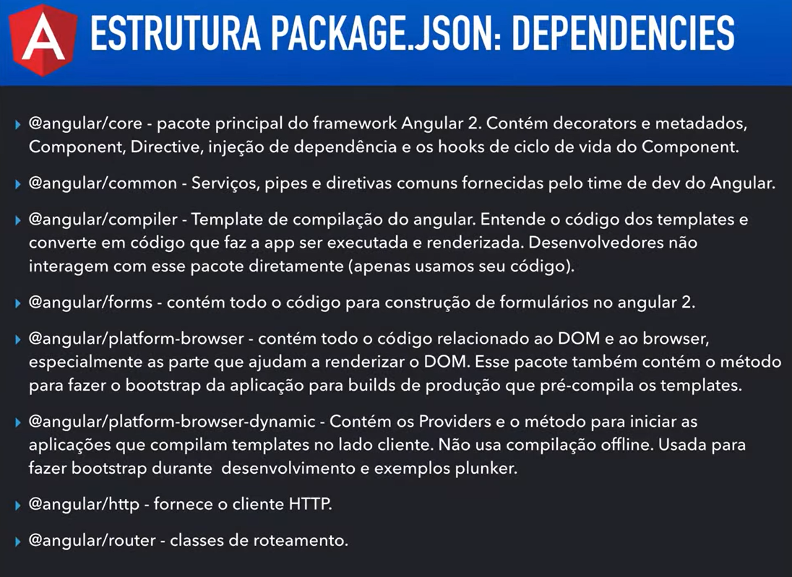
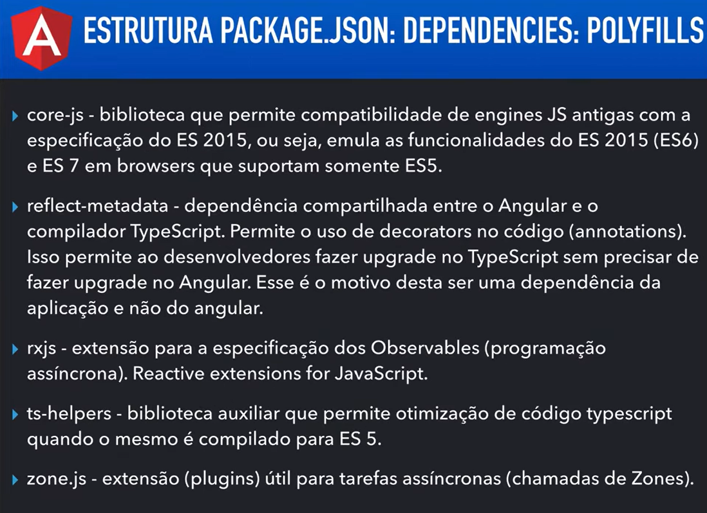
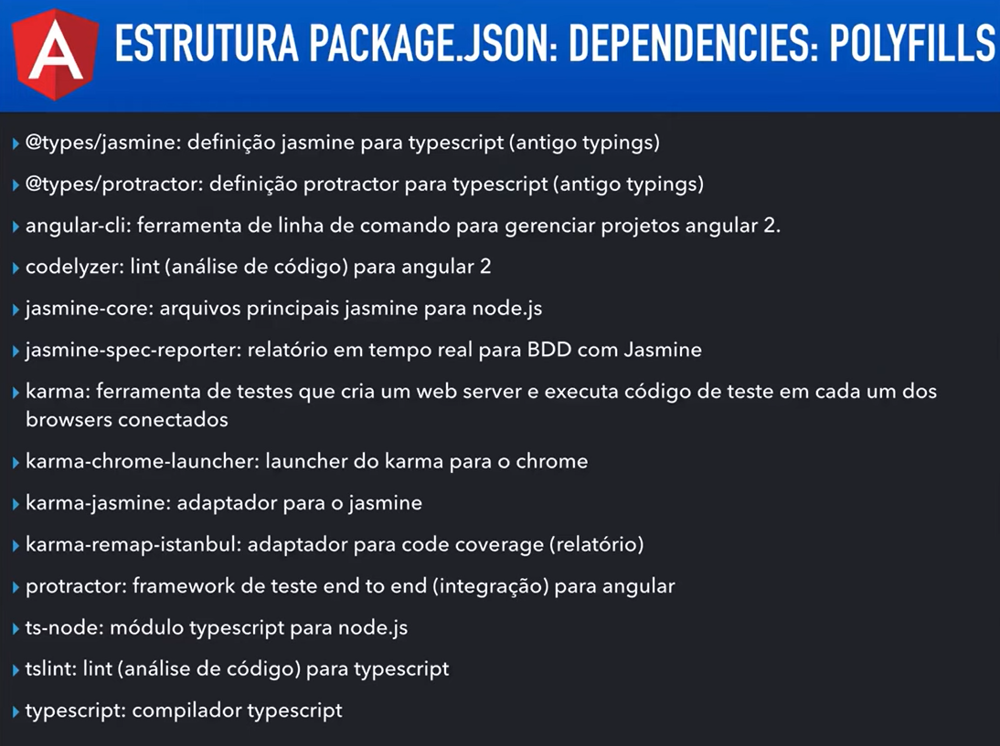

# Angular V2

## Aula 21 - Angular CLI - Estrutura do Projeto

### Conceitos-chave:

**CLI (Command Line Interface)**: O Angular possui uma ferramenta de linha de comando (ng) que cria projetos, gera componentes e executa a aplicação com comandos simples.



### 1. Visão Geral da Estrutura de Pastas

Quando você executa o comando `ng new meu-projeto`, o Angular CLI cria uma pasta com a seguinte estrutura padronizada:

```plaintext
meu-projeto/
├── .angular/
├── node_modules/
├── src/
│   ├── app/
│   │   ├── app.component.css
│   │   ├── app.component.html
│   │   ├── app.component.spec.ts
│   │   ├── app.component.ts
│   │   └── app.routes.ts
│   ├── assets/
│   ├── favicon.ico
│   ├── index.html
│   ├── main.ts
│   └── styles.css
├── angular.json
├── package.json
├── tsconfig.json
└── README.md
```



### 2. Detalhando a Raiz do Projeto

Na raiz da pasta do seu projeto, ficam os arquivos de configuração geral e gerenciamento de dependências:

#### `package.json`

- **O que é**: O manifesto do seu projeto Node.js.
- **Para que serve**: Lista todas as bibliotecas (packages) que seu projeto usa (como o próprio Angular, RxJS, Bootstrap, etc.) e os scripts de execução (ex: `npm start` para rodar o servidor local).









#### `node_modules/`

- **O que é**: A pasta onde ficam instaladas as dependências físicas baixadas pelo npm.
- **Nota importante**: Você nunca deve alterar nada manualmente dentro dessa pasta, nem enviá-la para o Git (ela é gerada automaticamente com o comando `npm install`).

#### `angular.json`

- **O que é**: A configuração global do Angular CLI.
- **Para que serve**: Define como seu projeto é construído (*build*) e executado (*serve*). Aqui você configura caminhos de arquivos de estilo globais, scripts externos, ambientes e atalhos.

#### `tsconfig.json`

- **O que é**: Configuração do compilador TypeScript.
- **Para que serve**: Define como o TypeScript deve converter seu código `.ts` para JavaScript compreensível pelo navegador.

### 3. O Coração do Projeto: A Pasta `src/`

Tudo o que se refere ao código-fonte da aplicação fica dentro de `src/` (source):

📄 `index.html`

- É a única página HTML real entregue ao navegador.
- Dentro da tag `<body>`, você verá uma tag personalizada como `<app-root></app-root>`. É ali que o Angular injetará dinamicamente toda a sua aplicação.

📄 `main.ts`

- É o ponto de entrada (*entrypoint*) do código TypeScript.
- Ele é o primeiro arquivo executado e é responsável por dar o "boot" (inicialização) na aplicação Angular, carregando o componente raiz.

📄 `styles.css` (ou `.scss`)

- Estilos CSS globais da aplicação. Qualquer regra escrita aqui afeta a página inteira.

📁 `assets/`

Pasta destinada a arquivos estáticos como imagens, ícones, fontes ou arquivos JSON locais.

### 4. Onde Você Vai Trabalhar: A Pasta `src/app/`

É dentro da pasta `app/` que você passará 90% do seu tempo programando. É aqui que ficam os componentes, serviços, rotas e módulos.

Por padrão, o Angular já vem com o componente principal chamado AppComponent.

#### Anatomia de um Componente Angular:

Um componente padrão no Angular é composto por 4 arquivos com o mesmo nome, diferindo apenas na extensão:

1. `app.component.ts` (Lógica):

    Contém a classe TypeScript com as variáveis, métodos e a lógica do componente. Possui o decorador `@Component()` que associa este arquivo ao HTML e ao CSS.

2. `app.component.html` (Visual):

    Contém o código HTML do componente.

3. `app.component.css` (Estilo):

    Contém os estilos que se aplicam exclusivamente a este componente (escopo isolado).

4. `app.component.spec.ts` (Testes):

    Arquivo reservado para testes unitários com Jasmine/Karma.

### 5. Fluxo de Inicialização: Como Tudo se Conecta?

Para entender o fluxo completo de execução quando você digita ng serve:

1. O navegador abre o arquivo `index.html`.
2. O Angular executa o `main.ts`.
3. O `main.ts` inicializa o componente principal (`AppComponent`).
4. O Angular procura a tag `<app-root>` dentro do `index.html` e substitui pelo HTML do `AppComponent`.
5. A partir daí, o `AppComponent` carrega os subcomponentes conforme o usuário interage ou navega pelas rotas.