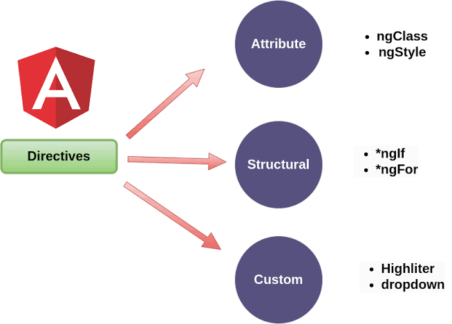

# Angular V2

## Aula 33 - Criando uma Diretiva de Atributo ElementRef e Renderer

Diretivas de atributo alteram a aparência ou o comportamento de um elemento HTML existente. Para manipular o elemento de forma segura em Angular, `ElementRef` e `Renderer2` (evoluído do antigo `Renderer`) trabalham juntos.

Para exemplificação foi criado a diretiva `fundo-amarelo`.

```bash
# Criação da Diretiva
ng g d shared/fundo-amarelo

# Criação do Componente para Utilização da Diretiva
ng g c diretivas-customizadas
```

### Categorias de diretivas no ecossistema Angular



### Conceitos Fundamentais

- **ElementRef**: Dá acesso direto ao elemento DOM hospedeiro por meio de sua propriedade `nativeElement`. Deve ser usado com cautela, pois o acesso direto ao DOM pode expor a aplicação a vulnerabilidades de XSS e quebrar a compatibilidade com Server-Side Rendering (Angular Universal) ou Web Workers.
- **Renderer2**: Uma camada de abstração para manipular o DOM com segurança. Em vez de modificar o `nativeElement` diretamente via JS nativo, usa-se o `Renderer2` para alterar estilos, classes e atributos.

#### Exemplo Prático: Diretiva de Destaque

Esta diretiva muda a cor de fundo do elemento quando o usuário passa o mouse por cima:

```TypeScript
import { Directive, ElementRef, Renderer2, HostListener, Input, OnInit } from '@angular/core';

@Directive({
  selector: '[appHighlight]' // Nome do atributo utilizado no HTML
})
export class HighlightDirective implements OnInit {
  @Input() defaultColor: string = 'transparent';
  @Input('appHighlight') highlightColor: string = 'yellow';

  constructor(
    private el: ElementRef,
    private renderer: Renderer2
  ) {}

  ngOnInit() {
    this.setBgColor(this.defaultColor);
  }

  // Manipula o evento de passar o mouse por cima
  @HostListener('mouseenter') onMouseEnter() {
    this.setBgColor(this.highlightColor || 'yellow');
  }

  // Manipula o evento de retirar o mouse
  @HostListener('mouseleave') onMouseLeave() {
    this.setBgColor(this.defaultColor);
  }

  // Abstração da alteração de estilo usando Renderer2
  private setBgColor(color: string) {
    this.renderer.setStyle(this.el.nativeElement, 'background-color', color);
  }
}
```

Como Utilizar no HTML

```HTML
<!-- Exemplo básico usando a cor padrão definida na diretiva -->
<p appHighlight>Passe o mouse aqui para destacar.</p>

<!-- Passando uma cor personalizada pela própria diretiva -->
<p [appHighlight]="'cyan'" defaultColor="lightgray">
  Passe o mouse para ver o destaque em ciano.
</p>
```

### Por que prefere-se o Renderer2 ao acesso direto (nativeElement)?

| Abordagem Direta (ElementRef.nativeElement.style...) | Abordagem com Renderer2 |
| :--- | :--- |
| Acesso direto ao DOM do navegador | Camada segura e genérica |
| Vulnerável a ataques de XSS | Higienização automática e prevenção contra falhas de segurança |
| Falha fora do navegador (SSR, Web Workers) | Compatível com renderização no servidor e plataformas alternativas |