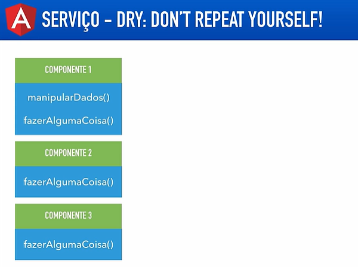
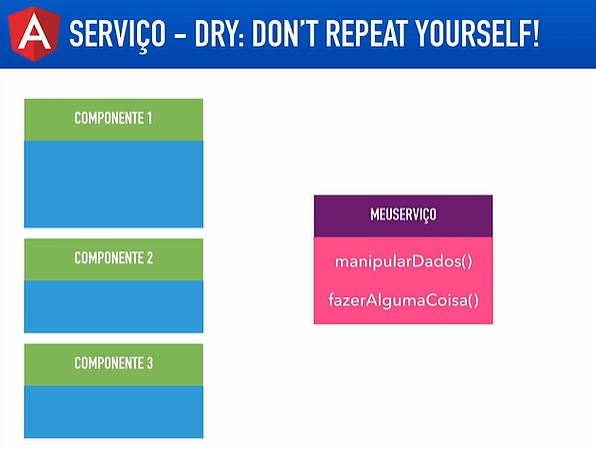
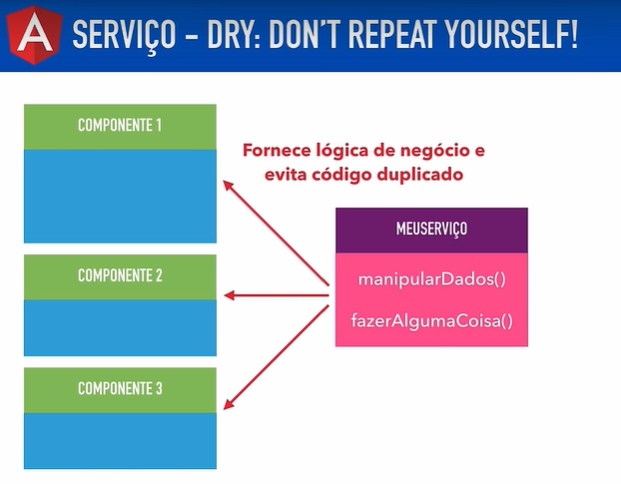
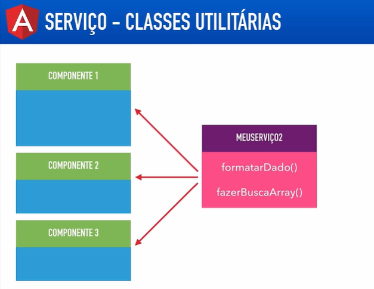

# Angular V2

## Aula 37 - Introdução a Serviços (Services)

Services (Serviços) no Angular são classes responsáveis por centralizar regras de negócio, manipular dados e integrar APIs externas. Eles permitem compartilhar informações e funcionalidades entre componentes sem poluir a camada de apresentação.

Para exemplificação foi criado um novo projeto `servicos`.

```bash
# Criação da Diretiva
ng new servicos --style=scss --skip-install
```

### Conceitos Principais

- **Separação de Responsabilidades**: Componentes devem focar no gerenciamento da interface (UI). Requisições HTTP, cálculos e lógica de estado devem residir em serviços.
- **Injeção de Dependência (DI)**: Padrão de projeto no qual o Angular cria e fornece instâncias de serviços automaticamente para os componentes ou outros serviços que deles necessitam via construtor.
- `@Injectable()`: Decorador que marca a classe como um serviço disponível para o sistema de Injeção de Dependência do Angular.


Nota: Principal finalidade do serviço é busca e envia dados do servidor, mas também são muito uteis para evitar a repetição de códigos, conforme exemplo abaixo:

Tratamento para evitar a repetição, quando o trecho de código é comum a mais de um componente é criado uma classe de serviço para permitir a centralização da logica.







Além de permitir a criação de classes utilitárias.



### Criando um Serviço Básico

```TypeScript
import { Injectable } from '@angular/core';

@Injectable({
  providedIn: 'root' // Singleton disponível em toda a aplicação
})
export class TarefaService {
  private tarefas: string[] = ['Aprender Angular', 'Estudar Services'];

  getTarefas(): string[] {
    return [...this.tarefas];
  }

  adicionarTarefa(novaTarefa: string): void {
    if (novaTarefa.trim()) {
      this.tarefas.push(novaTarefa);
    }
  }
}
```

#### Injetando e Utilizando o Serviço em um Componente

```TypeScript
import { Component, OnInit } from '@angular/core';
import { TarefaService } from './tarefa.service';

@Component({
  selector: 'app-lista-tarefas',
  template: `
    <h3>Minhas Tarefas</h3>
    <ul>
      <li *ngFor="let t of lista">{{ t }}</li>
    </ul>
    <button (click)="add()">Nova Tarefa</button>
  `
})
export class ListaTarefasComponent implements OnInit {
  lista: string[] = [];

  // O Angular injeta automaticamente a instância do serviço
  constructor(private tarefaService: TarefaService) {}

  ngOnInit(): void {
    this.lista = this.tarefaService.getTarefas();
  }

  add(): void {
    this.tarefaService.adicionarTarefa('Aprender RXJS');
    this.lista = this.tarefaService.getTarefas();
  }
}
```