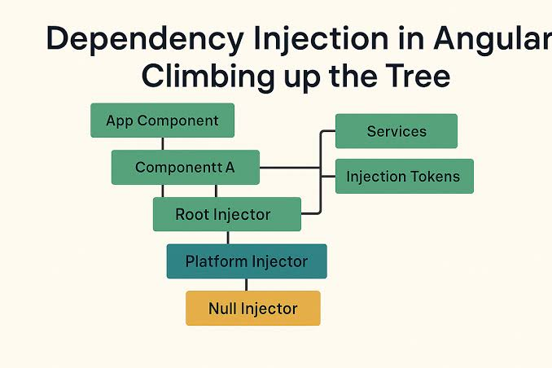
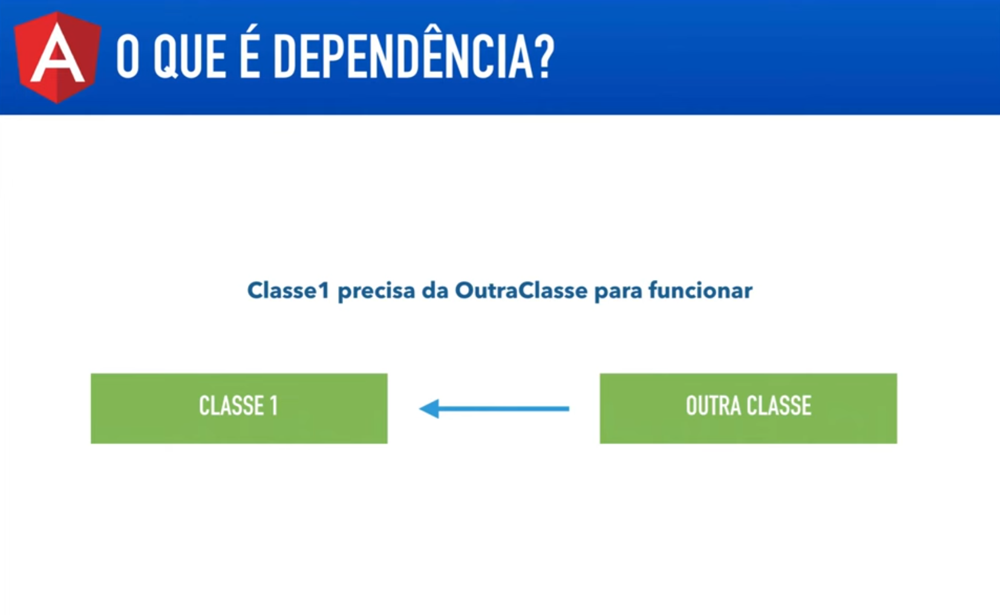
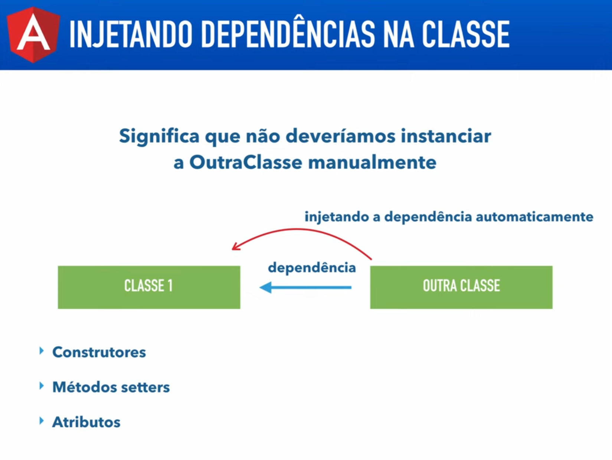

# Angular V2

## Aula 39 - Injeção de Dependência (DI) + Como Usar um Serviço em um Componente

A Injeção de Dependência (DI) é um padrão de projeto no qual o framework é responsável por instanciar os objetos que uma classe precisa para funcionar (suas dependências) e passá-los automaticamente para ela, em vez de a própria classe instanciá-los usando new.

Árvore de Injetores do Angular resolvendo dependências.



### Como Funciona o Fluxo de DI

- **Registrar o Provedor (`Provider`)**: Informa ao Angular como e onde a instância do serviço deve ser criada.
- **Pedir a Dependência**: O componente declara a necessidade do serviço através dos parâmetros de seu `constructor`.
- **Resolver e Injetar**: O Angular busca uma instância existente desse serviço na sua hierarquia de injetores (ou cria uma nova) e a fornece ao componente.

### Passo a Passo Prático

#### 1. Definindo o Serviço (`LogService`)

Marque a classe com `@Injectable()` para que o sistema de DI saiba que ela pode ser injetada.

```TypeScript
import { Injectable } from '@angular/core';

@Injectable({
  providedIn: 'root' // Registra o serviço no injetor Raiz (instância única/Singleton)
})
export class LogService {
  logarMensagem(msg: string): void {
    console.log(`[LOG - ${new Date().toLocaleTimeString()}]: ${msg}`);
  }
}
```

#### 2. Injetando e Usando no Componente

No construtor do componente, declare uma variável privada com o tipo do serviço. O modificador `private` ou `public` cria e inicializa a propriedade na classe automaticamente (*TypeScript parameter property*).

```TypeScript
import { Component, OnInit } from '@angular/core';
import { LogService } from './log.service';

@Component({
  selector: 'app-usuario',
  template: `
    <button (click)="salvar()">Salvar Usuário</button>
  `
})
export class UsuarioComponent implements OnInit {

  // O Angular reconhece o tipo LogService e injeta a instância aqui
  constructor(private logService: LogService) {}

  ngOnInit(): void {
    this.logService.logarMensagem('UsuarioComponent inicializado.');
  }

  salvar(): void {
    // Uso direto do método do serviço
    this.logService.logarMensagem('Usuário salvo com sucesso!');
  }
}
```

### Decoradores de Resolução Avançada no Construtor

Quando você precisa alterar a forma como o Angular busca a dependência:

- `@Optional()`: Impede um erro de runtime caso o serviço não tenha sido fornecido em nenhum nível (retorna `null`).
- `@Self()`: Força o Angular a buscar a dependência apenas no provedor do próprio componente.
- `@SkipSelf()`: Ignora o provedor do próprio componente e busca a dependência nos injetores pai.

### O que é dependência?

Uma dependência em desenvolvimento de software (e no Angular em particular) é qualquer classe, serviço, objeto, valor ou módulo externo de que uma classe necessita para conseguir realizar a sua função.

Quando uma classe A precisa de uma classe B para executar uma tarefa ou obter um dado, dizemos que a classe B é uma dependência da classe A.



A classe apenas declara do que precisa em seu construtor. Ela não se preocupa em saber como criar ou configurar essa dependência; o framework se encarrega de fornecê-la pronta para uso.

