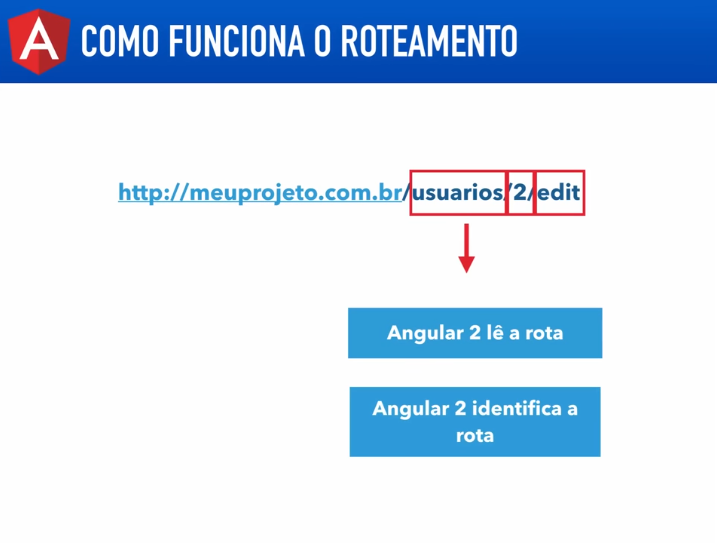
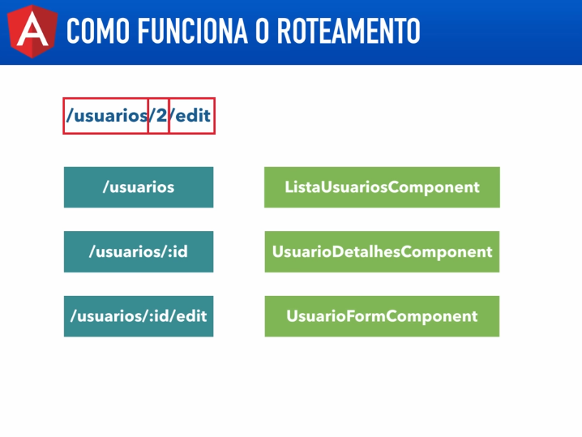

# Angular V2

## Aula 49 - Rotas: Introdução

O sistema de roteamento do Angular permite construir aplicações de página única (**SPA - Single Page Application**), navegando entre diferentes visualizações/componentes sem a necessidade de recarregar a página no navegador.





Nesta aula, foi criado um novo que será utilizado nas próximas aulas:

```bash
ng new rotas --skip-install --style-scss
```

### Instalação do `angular2-materialize`

O `angular2-materialize` necessita do pacote JavaScript nativo do `materialize-css` e da biblioteca de ícones `material-design-icons`. Incluídos no projeto através das 3 dependências abaixo:

```Typescript
"angular2-materialize": "15.0.4",
"material-design-icons": "^3.0.1",
"materialize-css": "0.98.2",
```

#### Declaração do CSS no arquivo `angular-cli.json`

Adicionado o pacote "material-design-icons": "^3.0.1" nas dependências do seu `package.json`, o arquivo CSS dos ícones já está disponível localmente no seu projeto.

#### Configurações Adicionais no Projeto

#### 1. Registrar os Scripts e Estilos no angular-cli.json

Abra o arquivo `.angular-cli.json` (ou `angular-cli.json`) e atualize o array de styles e scripts:

```Typescript
      "styles": [
        "../node_modules/material-design-icons/iconfont/material-icons.css",
        "../node_modules/materialize-css/dist/css/materialize.css",
        "styles.scss"
      ],
      "scripts": [
        "../node_modules/jquery/dist/jquery.js",
        "../node_modules/materialize-css/dist/js/materialize.js"
      ]
``` 

Configuração do Google Material Icons, Link CDN (Para inclusão via HTML), adicionado este link dentro da tag `<head>` no seu arquivo `src/index.html`:

```HTML
<link href="https://fonts.googleapis.com/icon?family=Material+Icons" rel="stylesheet">
```

### Hash

O Hash nas rotas (também conhecido como HashLocationStrategy) é uma estratégia de roteamento no Angular que utiliza o símbolo de cerquilha (`#`) na URL para simular a navegação entre páginas sem recarregar o navegador (exemplo: `[https://meusite.com/#/home](https://meusite.com/#/home)` ou `[https://meusite.com/#/sobre](https://meusite.com/#/sobre)`).

#### Por que a cerquilha (#) é usada?

Em navegadores web padrão, qualquer conteúdo enviado após a cerquilha (`#`) em uma URL é tratado como um identificador de fragmento local (usado originalmente para rolar a página até uma seção específica).

Por padrão do protocolo HTTP, o navegador nunca envia a parte do `#` para o servidor web.

URL solicitada ao servidor: `https://meusite.com/#/dashboard`
Servidor recebe apenas: `https://meusite.com/`

O servidor entrega o arquivo index.html da aplicação, e o roteador do Angular (no cliente) lê o trecho `#/dashboard` e renderiza o componente correspondente na tela.